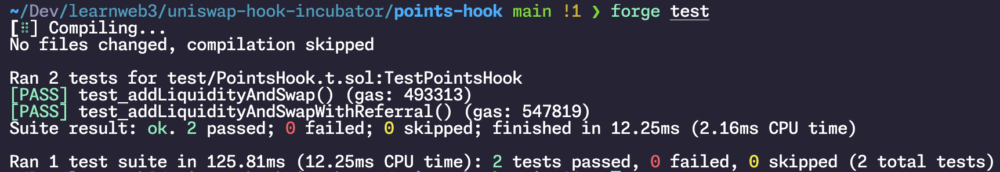

# Building your first hook

## Mechanism Design

I find it helpful to first think about, conceptually, how this is going to be designed before we jump into writing code for it.

Let's recap the hook functions we have available:

```
beforeInitialize
afterInitialize

beforeAddLiquidity
beforeRemoveLiquidity
afterAddLiquidity
afterRemoveLiquidity

beforeSwap
afterSwap

beforeDonate
afterDonate

beforeSwapReturnDelta
afterSwapReturnDelta
afterAddLiquidityReturnDelta
afterRemoveLiquidityReturnDelta
```

Based on the design we want, as outlined under the Introduction section - we want to issue points in two cases:

1. When a swap occurs which buys TOKEN for ETH
2. When liquidity is added to the pool

For Case (1) - we can use either `beforeSwap` or `afterSwap`

For Case (2) - we can use either `beforeAddLiquidity` or `afterAddLiquidity`

However, we can restrict our choice a bit further by looking at the function signatures of these hooks. Let's take a look at `beforeSwap` vs `afterSwap`

```solidity
beforeSwap(
address sender,
PoolKey calldata key,
IPoolManager.SwapParams calldata params,
bytes calldata hookData
)

afterSwap(
address sender,
PoolKey calldata key,
IPoolManager.SwapParams calldata params,
BalanceDelta delta,
bytes calldata hookData
)
```

From this we can see that `afterSwap` provides us an additional argument - `BalanceDelta delta`. Is this something we need? Turns out, yes.

## The two types of swaps

When swapping - the user specifies their swap parameters in one of two ways.

1. **Exact Input for Output** - Specifying an exact amount of input tokens, in exchange for some calculated amount of output tokens. E.g. "I want to sell exactly 1 ETH for some amount of USDC"
2. **Exact Output for Input** - Specifying an exact amount of output tokens, in exchange for some calculated amount of input tokens up to a limit. "E.g. I want exactly 4000 USDC, and can spend up to 1.5 ETH for that"

The way they choose this is based on the `amountSpecified` parameter of the `SwapParams` struct. Since values in Uniswap are always represented from the perspective of the user, the user has two options:

1. Specify a negative value for `amountSpecified`. A negative value implies "money going out from the user's wallet". This is taken to mean an "exact input for output" swap. They are specifying exactly how much money will leave their wallet, in exchange for some calculated amount of output tokens.
2. Specify a positive value for `amountSpecified`. A positive value implies "money coming in to the user's wallet". This is taken to mean an "exact output for input" swap. They are specifying exactly how much money they want coming in to their wallet, in exchange for some calculated amount of input tokens.

So - since an ETH → TOKEN swap can happen either way (exact input for output, or exact output for input) - we will not always know how much ETH they actually spent. We will know it for sure if they specify ETH as an exact input amount, but not if they specify TOKEN as an exact output amount - if we try to derive it from just `SwapParams`.

## Choosing the hook functions

Therefore, to reliably figure out how much ETH they are spending - the ``beforeSwap` hook doesn't really give us that information. The additional `BalanceDelta delta` value present in `afterSwap` though, that has the exact amounts of how much ETH is being spent for how much TOKEN since at that point it has already done those calculations.

So - For Case (1) - minting POINTS in case of swaps, we know we will need to use `afterSwap` now.

Similarly, for Case (2) - the `afterAddLiquidity` hook also gives an additional `BalanceDelta` delta input that is not present in `beforeAddLiquidity`.

The user might originally send some amount of ETH but when the contract calculates the proper ratio of ETH:TOKEN required to add liquidity in their chosen price range, they may have sent additional ETH than necessary, which will be returned to them.

Therefore, to reliably know exactly how much ETH is actually being added to liquidity - we will again use `afterAddLiquidity` here because the `BalanceDelta delta` value can provide the exact information to us.

Hopefully that makes sense now. I know it's a bit of a wall of text - but feel free to ask clarifying questions if something seems unclear and we'll also use that feedback to improve the lesson overall for everyone.

## Creating `PointsHook.sol`

Alright, at this point, we can start working on our code.

### Setting up Foundry

The first thing we'll do is set up a new Foundry project.

If you don't have Foundry installed on your computer already - you can follow the instructions at this link for your operating system - https://book.getfoundry.sh/getting-started/installation

Once Foundry is setup, in your terminal, type the following to initialize a new project:

```shell
forge init points-hook
```

This will create a new folder named points-hook with some boilerplate code inside it.

Now, let's install the Uniswap v4-periphery contracts as a dependency.

```shell
forge install https://github.com/Uniswap/v4-periphery
```

Next, we'll set up the remappings so that our shorthand syntax for importing contracts from the dependencies work nicely.

```shell
forge remappings > remappings.txt
```

Finally, we can get rid of the default `Counter` contract and its associated test and script file that Foundry initially set up for us. To do that, you can either manually delete those files, or just run the following:

```shell
rm ./\*_/Counter_.sol
```

Great!

One last thing, actually. Since v4 uses transient storage which is only available after Ethereum's cancun hard fork and on Solidity versions >= 0.8.24 - we must set some config in our `foundry.toml` config file.

To do that, open up the generated `foundry.toml` config file, and add the following lines to it:

```toml
# foundry.toml

solc_version = '0.8.26'
evm_version = "cancun"
optimizer_runs = 800
via_ir = false
ffi = true
```

Awesome - now we're all set up to start building our hook!

## Hook Structure

Let's start off by setting up the structure for our hook. We know a few things already:

1. We will use `afterSwap` and `afterAddLiquidity` hook functions
2. We will issue points to users in the form of an ERC-20 token

So, to start, every hook we create can inherit from the `BaseHook` contract which is an abstract contract from the `v4-periphery dependency`. Additionally, we'll also make our hook contract inherit from `ERC20` since it will be minting new POINTS tokens. Thankfully, when we install `v4-periphery`, we also get `solmate` and `OpenZeppelin` contracts as sub-dependencies - though we will only be using the `solmate` ERC20 contract for now.

Create a new file named `PointsHook.sol` inside the src/ directory, and write the following code:

```solidity
// SPDX-License-Identifier: MIT
pragma solidity 0.8.26;

import {BaseHook} from "v4-periphery/src/base/hooks/BaseHook.sol";
import {ERC20} from "solmate/src/tokens/ERC20.sol";

import {CurrencyLibrary, Currency} from "v4-core/types/Currency.sol";
import {PoolKey} from "v4-core/types/PoolKey.sol";
import {BalanceDeltaLibrary, BalanceDelta} from "v4-core/types/BalanceDelta.sol";

import {IPoolManager} from "v4-core/interfaces/IPoolManager.sol";

import {Hooks} from "v4-core/libraries/Hooks.sol";

contract PointsHook is BaseHook, ERC20 {
// Use CurrencyLibrary and BalanceDeltaLibrary
// to add some helper functions over the Currency and BalanceDelta
// data types
using CurrencyLibrary for Currency;
using BalanceDeltaLibrary for BalanceDelta;

    // Initialize BaseHook and ERC20
    constructor(
        IPoolManager _manager,
        string memory _name,
        string memory _symbol
    ) BaseHook(_manager) ERC20(_name, _symbol, 18) {}

    // Set up hook permissions to return `true`
    // for the two hook functions we are using
    function getHookPermissions()
        public
        pure
        override
        returns (Hooks.Permissions memory)
    {
        return
            Hooks.Permissions({
                beforeInitialize: false,
                afterInitialize: false,
                beforeAddLiquidity: false,
                beforeRemoveLiquidity: false,
                afterAddLiquidity: true,
                afterRemoveLiquidity: false,
                beforeSwap: false,
                afterSwap: true,
                beforeDonate: false,
                afterDonate: false,
                beforeSwapReturnDelta: false,
                afterSwapReturnDelta: false,
                afterAddLiquidityReturnDelta: false,
                afterRemoveLiquidityReturnDelta: false
            });
    }

    // Stub implementation of `afterSwap`
    function afterSwap(
        address,
        PoolKey calldata key,
        IPoolManager.SwapParams calldata swapParams,
        BalanceDelta delta,
        bytes calldata hookData
    ) external override onlyPoolManager returns (bytes4, int128) {
    	// We'll add more code here shortly
    	return (this.afterSwap.selector, 0);
    }

    // Stub implementation for `afterAddLiquidity`
    function afterAddLiquidity(
        address,
        PoolKey calldata key,
        IPoolManager.ModifyLiquidityParams calldata,
        BalanceDelta delta,
    	BalanceDelta,
        bytes calldata hookData
    ) external override onlyPoolManager returns (bytes4, BalanceDelta) {
    	// We'll add more code here shortly
        return (this.afterAddLiquidity.selector, delta);
    }

}
```

Hopefully most of this should be fairly self explanatory. The two libraries we imported aren't actually being used right now - but we'll see their uses shortly. Apart from that, we're just initializing the hook and the ERC-20 contract, set up the read only function which specifies which permissions this hook needs, and created stub functions for `afterSwap` and `afterAddLiquidity`.

Also, note that hook functions return their own function selector at the end. This must be true always, and if something other than the selector is returned, the hook call is considered unsuccessful. The second argument being returned from `afterSwap` can be safely set to 0 for now - and will be 0 for most of the use cases. What it means and how that second argument works is a topic for later when we study NoOp hooks.

## Assigning Points

Before we code out the actual hook functions, let's create a little helper function to mint tokens to the user when it is time to assign points.

Note that both our hook functions - and actually all hook functions - have a `bytes calldata hookData` parameter that comes with it. This param can be used to attach arbitrary data for usage by the hook. We'll use this parameter to encode data about whom the user is (who should get points). We cannot use the `address sender` parameter in hook functions to do that since that contains the address of the router contract. Therefore, we will ask the user to pass in their own address via `hookData` by simply `abi.encode`'ing their own address.

Now, let's also create a helper `_assignPoints` function that we can just call when we figure out how many points to assign

```solidity
function _assignPoints(bytes calldata hookData, uint256 points) internal {
// If no hookData is passed in, no points will be assigned to anyone
if (hookData.length == 0) return;

    // Extract user address from hookData
    address user = abi.decode(hookData, (address));

    // If there is hookData but not in the format we're expecting and user address is zero
    // nobody gets any points
    if (user == address(0)) return;

    // Mint points to the user
    _mint(user, points);

}
```

Great! I've added comments alongside the code to explain a bit of what's going on here.

But with this helper in place, now we can move on to actually writing our hook functions!

## afterSwap

Let's quickly recall our requirements for how and when to assign points for a swap.

1. Make sure this is a `ETH - TOKEN` pool
2. Make sure this swap is to buy `TOKEN` in exchange for `ETH`
3. Mint points equal to 20% of the amount of ETH being swapped in

Let's replace our stub `afterSwap` implementation with the following:

```solidity
function afterSwap(
    address,
    PoolKey calldata key,
    IPoolManager.SwapParams calldata swapParams,
    BalanceDelta delta,
    bytes calldata hookData
) external override onlyPoolManager returns (bytes4, int128) {
// If this is not an ETH-TOKEN pool with this hook attached, ignore
if (!key.currency0.isAddressZero()) return (this.afterSwap.selector, 0);

    // We only mint points if user is buying TOKEN with ETH
    if (!swapParams.zeroForOne) return (this.afterSwap.selector, 0);

    // Mint points equal to 20% of the amount of ETH they spent
    // Since its a zeroForOne swap:
    // if amountSpecified < 0:
    //      this is an "exact input for output" swap
    //      amount of ETH they spent is equal to |amountSpecified|
    // if amountSpecified > 0:
    //      this is an "exact output for input" swap
    //      amount of ETH they spent is equal to BalanceDelta.amount0()

    uint256 ethSpendAmount = uint256(int256(-delta.amount0()));
    uint256 pointsForSwap = ethSpendAmount / 5;

    // Mint the points
    _assignPoints(hookData, pointsForSwap);

    return (this.afterSwap.selector, 0);

}
```

## afterAddLiquidity

For adding liquidity, our conditions are mostly similar, but actually simpler.

1. Make sure it's an ETH - TOKEN pool
1. Mint points equivalent to amount of ETH being supplied as liquidity

Let's replace our stub with this:

```solidity
function afterAddLiquidity(
    address,
    PoolKey calldata key,
    IPoolManager.ModifyLiquidityParams calldata,
    BalanceDelta delta,
    BalanceDelta,
    bytes calldata hookData
) external override onlyPoolManager returns (bytes4, BalanceDelta) {
// If this is not an ETH-TOKEN pool with this hook attached, ignore
if (!key.currency0.isAddressZero()) return (this.afterSwap.selector, delta);

    // Mint points equivalent to how much ETH they're adding in liquidity
    uint256 pointsForAddingLiquidity = uint256(int256(-delta.amount0()));

    // Mint the points
    _assignPoints(hookData, pointsForAddingLiquidity);

    return (this.afterAddLiquidity.selector, delta);

}
```

Amazing! We're actually… done? Our hook is ready - let's write some basic tests now.

## Testing

If you haven't used Foundry before, a great reason to use Foundry is that tests and scripts in Foundry are also written in Solidity. Unlike Truffle or Hardhat, this is great because we don't have to deal with things like constantly converting values to and from `BigInt` and `uint256` and the likes - everything is just native Solidity (with some additional "cheat codes" on top)

For now though we'll keep our tests fairly simple just to make sure our code is doing what it's supposed to be doing.

But - before we start writing tests - let's take a quick detour and talk about the hook deployment address.

## Hook Contract Address

Remember the hook address bitmap?

The PoolManager determines which hook functions to call during the flow of an operation based on a bitmap encoded directly into the hook's address. Each hook function - like `afterSwap` - is represented by a true/false value at a specific bit of the hook's address.

Therefore, when we are looking to deploy our code (which we will do on a local testnet node to run tests), we need to "mine" for an address that meets our criteria. For local testing, we can use a cheat code present in Foundry called `deployCodeTo` which will let us deploy our contract to any address we like. On a proper deployment to an actual network, there is a helper `HookMiner` library that can be used to mine for correct addresses - but we don't use it right now because it can take 5-10 minutes to mine that address which is really bad for running tests.

As for figuring out the correct address, remember that our only constraint is that the bits we care about should be 1 in the address, and the rest are irrelevant. As such, we can simply create an address which is all zeroes except having ones at the specific flag positions we're interested in.

Let's review a simple example real quick. Let's say we want to "create" the address which is all zeroes but has a one at the very end, i.e. the first bit.

First, we recall that an address is 20 bytes or 160 bits, so we can use a `uint160` type to represent the numerical value.

Secondly, we recall that Solidity by default assigns a zero value to any numeric data types if not specified.

Therefore, all we need to do is create a `uint160` type and then flip the specific bit we care about, and then convert the `uint160` to an `address` type.

So for our example of trying to come up with an address with a single 1 bit at the end, we can simply do:

```solidity
uint160 flags = uint160(1 << 0);

address myAddr = address(flags);
```

`1 « 0` is simply 1 left-shifted by 0, i.e. `1 \* 2^0` which is just `1`. Therefore, we assigned `myAddress` to the decimal value 1. When we type cast this to an address type, it will pad the value `0x1` with extra zeroes and we end up at `0x0000000000000000000000000000000000000001`

Maybe this was a simple example though, let's consider generating an address that has 1 at the fourth bit and zeroes otherwise.

If we repeat the same code, let's see what happens:

```solidity
uint160 flags = uint160(1 << 3);

address myAddr = address(flags);
```

In this case, we use `1 « 3` which is `1 \* 2^3` i.e. `8` in decimal. `8` in binary is simply `1000`, and the hex representation is `0x8`

So, the value of `flags` here is `0x8`

When we convert this to an address, it pads the extra zeroes and we get `0x0000000000000000000000000000000000000008`

If you convert it to binary, you'll see the trailing 4 bits being `1000` i.e. we got a `1` at the fourth bit and `0` everywhere else.

If we want to repeat this process for setting multiple `1` bits, we can just combine multiple flags together. For example, to have a `1` at both the first bit and the fourth bit, we simply do:

```solidity
uint160 flags = uint160(1 << 0 | 1 << 3);

address myAddr = address(flags);
```

The `|` is the `OR` operator, which will result in a final value of having a 1 as long as either `1 « 0` OR `1 « 3` have a 1 at this index. This gives us the final result of `0x0000000000000000000000000000000000000009` which is satisfactory.

## PointsHook.t.sol

Now we can write our tests. Create a file named `PointsHook.t.sol` under the `test/` directory. Note it must end with `.t.sol` - that's what tells Foundry this is a test file.

If you haven't done Foundry testing before, I'll go over a couple key points:

1. Each test contract must import from the `Test.sol` contract included in the `forge-std` library installed by default in every Foundry project
2. Each test contract must have a `setUp()` function that does whatever initialization is necessary. In our case, this means deploying the hook and attaching it to a pool, for example.
3. Every individual test must be a public function in the contract whose name starts with `test_`

We'll import mostly the same contracts as in our actual hook code - with a couple neat helpers. Let's set up the initial structure first:

```solidity
// SPDX-License-Identifier: MIT
pragma solidity ^0.8.0;

import {Test} from "forge-std/Test.sol";

import {Deployers} from "@uniswap/v4-core/test/utils/Deployers.sol";
import {PoolSwapTest} from "v4-core/test/PoolSwapTest.sol";
import {MockERC20} from "solmate/src/test/utils/mocks/MockERC20.sol";

import {PoolManager} from "v4-core/PoolManager.sol";
import {IPoolManager} from "v4-core/interfaces/IPoolManager.sol";

import {Currency, CurrencyLibrary} from "v4-core/types/Currency.sol";

import {Hooks} from "v4-core/libraries/Hooks.sol";
import {TickMath} from "v4-core/libraries/TickMath.sol";
import {SqrtPriceMath} from "v4-core/libraries/SqrtPriceMath.sol";
import {LiquidityAmounts} from "@uniswap/v4-core/test/utils/LiquidityAmounts.sol";

import "forge-std/console.sol";
import {PointsHook} from "../src/PointsHook.sol";

contract TestPointsHook is Test, Deployers {
using CurrencyLibrary for Currency;

    MockERC20 token; // our token to use in the ETH-TOKEN pool

    // Native tokens are represented by address(0)
    Currency ethCurrency = Currency.wrap(address(0));
    Currency tokenCurrency;

    PointsHook hook;

    function setUp() public {
    	// TODO
    }

}
```

Note that we are inheriting from a `Deployers` contract, provided from `@uniswap/v4-core/test/utils/Deployers.sol`. This is a nice little helper that contains a bunch of utility functions to ease with testing - for e.g. `deployFreshManagerAndRouters()` which deploys the `PoolManager` contract, a `SwapRouter`, a `ModifyPositionRouter`, and so on for us without us needing to do it manually. We'll make use of these helpers within our `setUp` function.

Apart from that, we're setting some storage values to keep track of certain values we'll need to use in our individual test functions. This includes our token contract we'll deploy, wrapped `Currency` versions of the token pair in the pool we will create, and a reference to our hook contract.

Let's now start actually writing the setUp function. Basically, before we can test our hook, we need to:

1. Deploy an instance of the PoolManager
2. Deploy periphery router contracts for swapping, modifying liquidity, etc
3. Deploy the `TOKEN` ERC-20 contract (we'll use MockERC20 here)
4. Mint a bunch of TOKEN supply to ourselves, so we can use it for adding liquidity
5. Mine a contract address for our hook using `HookMiner`
6. Deploy our hook contract
7. Approve our `TOKEN` for spending on the periphery router contracts
8. Create a new pool for `ETH` and `TOKEN` with our hook attached

```solidity
function setUp() public {
// Step 1 + 2
// Deploy PoolManager and Router contracts
deployFreshManagerAndRouters();

    // Deploy our TOKEN contract
    token = new MockERC20("Test Token", "TEST", 18);
    tokenCurrency = Currency.wrap(address(token));

    // Mint a bunch of TOKEN to ourselves
    token.mint(address(this), 1000 ether);

    // Deploy hook to an address that has the proper flags set
    uint160 flags = uint160(
        Hooks.AFTER_ADD_LIQUIDITY_FLAG | Hooks.AFTER_SWAP_FLAG
    );
    deployCodeTo(
        "PointsHook.sol",
        abi.encode(manager, "Points Token", "TEST_POINTS"),
        address(flags)
    );

    // Deploy our hook
    hook = PointsHook(address(flags));

    // Approve our TOKEN for spending on the swap router and modify liquidity router
    // These variables are coming from the `Deployers` contract
    token.approve(address(swapRouter), type(uint256).max);
    token.approve(address(modifyLiquidityRouter), type(uint256).max);

    // Initialize a pool
    (key, ) = initPool(
        ethCurrency, // Currency 0 = ETH
        tokenCurrency, // Currency 1 = TOKEN
        hook, // Hook Contract
        3000, // Swap Fees
        SQRT_PRICE_1_1 // Initial Sqrt(P) value = 1
    );

}
```

I have added comments over the code to explain what is going on, but it's basically the 8 steps outlined above.

With the set up complete, we can start writing tests. For now, we are going to keep things simple and only write one test

- Add Liquidity + Swap - make sure we get points for both adding liquidity and for swapping

## Add Liquidity + Swap

First, let's create the function for Case (1):

```solidity
function test_addLiquidityAndSwap() public {
uint256 pointsBalanceOriginal = hook.balanceOf(address(this));

    // Set user address in hook data
    bytes memory hookData = abi.encode(address(this));

    uint160 sqrtPriceAtTickLower = TickMath.getSqrtPriceAtTick(-60);
    uint160 sqrtPriceAtTickUpper = TickMath.getSqrtPriceAtTick(60);

    uint256 ethToAdd = 0.1 ether;
    uint128 liquidityDelta = LiquidityAmounts.getLiquidityForAmount0(
        sqrtPriceAtTickLower,
        SQRT_PRICE_1_1,
        ethToAdd
    );
    uint256 tokenToAdd = LiquidityAmounts.getAmount1ForLiquidity(
        sqrtPriceAtTickLower,
        SQRT_PRICE_1_1,
        liquidityDelta
    );

    modifyLiquidityRouter.modifyLiquidity{value: ethToAdd}(
        key,
        IPoolManager.ModifyLiquidityParams({
            tickLower: -60,
            tickUpper: 60,
            liquidityDelta: int256(uint256(liquidityDelta)),
            salt: bytes32(0)
        }),
        hookData
    );
    uint256 pointsBalanceAfterAddLiquidity = hook.balanceOf(address(this));

    assertApproxEqAbs(
        pointsBalanceAfterAddLiquidity - pointsBalanceOriginal,
        0.1 ether,
        0.001 ether // error margin for precision loss
    );

    // Now we swap
    // We will swap 0.001 ether for tokens
    // We should get 20% of 0.001 * 10**18 points
    // = 2 * 10**14
    swapRouter.swap{value: 0.001 ether}(
        key,
        IPoolManager.SwapParams({
            zeroForOne: true,
            amountSpecified: -0.001 ether, // Exact input for output swap
            sqrtPriceLimitX96: TickMath.MIN_SQRT_PRICE + 1
        }),
        PoolSwapTest.TestSettings({
            takeClaims: false,
            settleUsingBurn: false
        }),
        hookData
    );
    uint256 pointsBalanceAfterSwap = hook.balanceOf(address(this));
    assertEq(
        pointsBalanceAfterSwap - pointsBalanceAfterAddLiquidity,
        2 * 10 ** 14
    );

}
```

As you can see, we first add some liquidity in the pool, ensure we got points equivalent to how much `ETH` of liquidity we added, then we conduct a swap to purchase `TOKEN` for `0.001` ETH and ensure we got another `20% of 0.0001` `POINTS` tokens for the swap.

One thing that may be confusing to see is when we are adding liquidity, we say `liquidityDelta = 1 ether`, but are transferring `amount0Delta + 1` to the function call as value. Well, `liquidityDelta` is not an amount, directly.

If you remember from the Ticks and Q64.96 Numbers lesson - there was an equation we showed that we used to calculate how much `y` amount of tokens we need if we want to add liquidity over a certain price range given a certain amount of `x`.

In this case, instead of knowing `x` beforehand, we are saying we know `L` beforehand - which is `10**18`. We can use the value of `L` and rearrange the equation to instead calculate both `x` and `y`.

To dive deeper into these concepts, while not required, you can read this blog post I wrote on how these calculations work - https://hackmd.io/@vFMCdNzHQNqyPq_Rej0IIw/H12JlwSYA

Apart from that, the test is fairly basic.

1. We add liquidity such that we're adding roughly 0.003 ETH (its actually slightly lower than that)
2. We check we got roughly 0.003 POINTS
3. Then we swap 0.001 ETH for TOKEN
4. We check we got 20% of 0.001 = 0.0002 POINTS for doing that

At this point, we should be good to go. Run the following in your terminal to check if the tests are passing:

```shell
forge test
```

and it should give you something like this:



If you see this screen - great! If they're failing, something is wrong - try and see what that is, or come ask for help.

## Further Improvements + Conclusion

This implementation is far from perfect - and far from being a production level heavy (even if you are convinced of the idea). There are some edge cases here we haven't handled, and also our tests are far from comprehensive (though being such a simple hook, maybe there isn't much going wrong anyway).

For further improvements that are known, but we skipped over for the sake of keeping this a short, beginner friendly lesson:

1. The `POINTS` token is easily game-able by anyone by creating a new pool for some random token and attaching this hook to it, and just wash-trading back and forth and farm a ton of `POINT`s. This can be fixed by either restricting the hook to a specific token pair - not just checking if `ETH` is Token 0 but also checking what Token 1 is, or it can be fixed by using different ERC-20 contracts for different pools by deploying new contracts in the `afterInitialize` hook which runs every time a new pool is initialized with this hook attached (or you can use ERC-6909 here!).
2. For seriously doing something like this, you probably also want to do something inside `afterRemoveLiquidity` - maybe enforce a minimum time for how long they need to lock up their liquidity for. Otherwise the hook is game-able by just adding and removing liquidity over and over again to farm `POINTs`.

With that said, the goal of this lesson was not to build an actual, meaningful, production-level hook. That will generally be the theme for the course. While we will be building much more complex hooks than this one, there will always be some edge cases somewhere that will make it not ideal for deploying to production as-is ,so we can stick within the time slots we have for workshops and not make this course last months and months instead of a few weeks. You can, however, improve upon these ideas and make them more production-ready for use in your Capstone Projects, or just build your own ideas anyway. As always, building something production-ready is a longer process than can fit in a single 90 minute workshop or things like that, so treat these as "Proof of Concepts".

BUT - hopefully you learned some stuff! You've successfully now built your first hook and tested it.

Originally we planned on making you deploy this to Ethereum Sepolia as well - but as of right now, the v4 deployment on Sepolia does not match what we are working with locally when cloning and working off of v4-periphery which makes it not possible to deploy on Sepolia right now. When code freeze happens for v4, we expect a new deployment on testnets, after which we will be deploying hooks we make to the testnet. For now - local testing with Foundry and anvil will have to do.

As always, if you have any questions - join the workshop for a walkthrough, reach out on the Discord Channel or group chat, or come to Haardik/Sauce's office hours.
