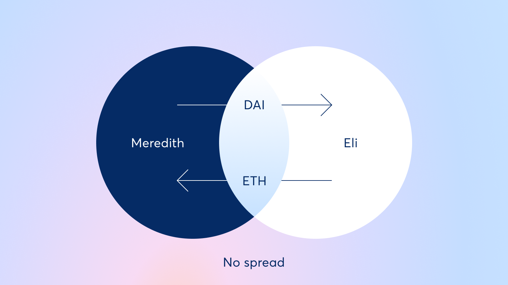
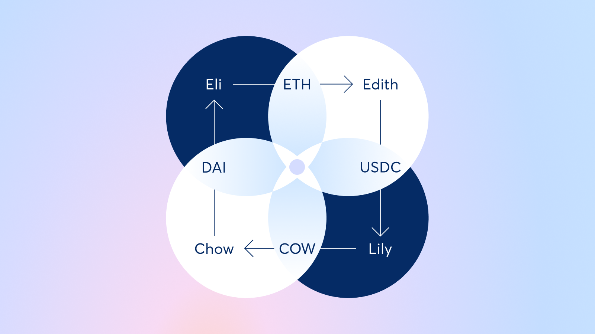
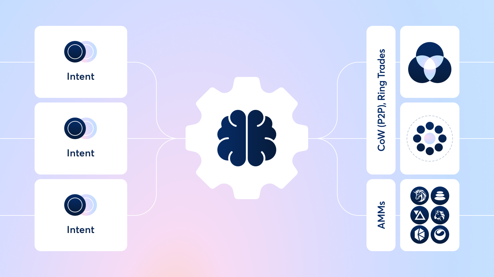

# MEV: Coincidence of Wants

## Intro and Objectives

### Lesson Objectives

- Learn about CoW as an economic concept
- Gain a high level understanding of CoWSwap
- Learn how we can design a CoW mechanism using Uniswap hooks

### Introduction

In today's short but sweet lesson we're going to talk about Coincidence of Wants - a concept popularized within AMMs through DEXes like CoWSwap. It's a super interesting mechanism that allows for better price efficiency for swappers by optimally matching orders together, and now we can build it with hooks!

## Coincidence of Wants

Coincidence of Wants, aka CoW, is an economic phenomenon where two parties each hold an item that the other one wants, so they exchange those items directly. This is kind of similar to a barter trading system that was used hundreds of years ago where two parties would exchange their chickens and cotton against each other directly before the concept of "money" as a middleman came into play.

In the context of DeFi, and particularly exchanges, the simplest form of CoW is a direct trade between two parties that behaves like a P2P exchange.

For example, if Meredith wants to sell 1 ETH for 3,500 DAI, and Eli wants to buy 1 ETH for 3,500 DAI, they can both just trade with each other directly. Doing so allows them to both get what they want without going through an AMM pool which allows for a zero slippage swap which neither party has to pay swap fees on.

A more complex form of CoW exists when more than two parties can form a closed loop ring by trading items with each other. For example:

- Eli wants to sell ETH for DAI
- Edith wants to buy ETH for USDC (sell USDC for ETH)
- Lily wants to buy USDC for COW (sell COW for USDC)
- Chow wants to buy COW for DAI (sell DAI for COW)

The four of them can close a loop amongst each other:

Even more complex forms of CoW can exist if multiple rings are formed where certain trades happen between the different rings due to differing amounts wanting to be exchanged - but simple P2P ones and closed loop ones are good enough for now.

In the context of a DEX, there are clear pros and cons to implementing CoW based order matching:

- **Pro**: zero slippage for swappers and no LP fees since trade doesn't go through the AMM pools
- **Con**: path optimization is a hard problem to solve for
- **Con**: usually not an "instant" process like an atomic AMM trade since orders need to be matched against other orders during a certain time window generally

But it's not just about matching coincidences - that's the job of an orderbook based exchange. So how does a CoW enabled AMM (like CoWSwap) differ from an orderbook?

## CoWSwap

DEXes like CoWSwap attempt to maximize the usage of the CoW phenomenon as much as possible, but eventually fall back to to more "traditional" liquidity at existing liquidity sources if they need to.

The high level workflow of how this works is:

1. User sends a signed transaction allowing CoWSwap to transfer their tokens into their contract
2. Transactions within a certain time frame are grouped into "batches"
3. Once a batch is full (either based on a certain amount of time passing or a maximum number of txns in the batch), an offchain group of "solvers" attempts to maximally perform CoW matching on the txns
4. To do so, the processor attempts to identify all the P2P or Ring based CoW matching it can
5. For leftover trades it finds the best paths possible at the time from alternative onchain or offchain liquidity sources
6. The solver which commits to providing the maximal amount of output tokens from the batch wins the rights to process that batch
7. The solver conducts an onchain transaction that fulfills all the user transactions, and is rewarded in COW token to do so

## CoW in Hooks

In the context of Uniswap v4 hooks, we won't go as far as attempting to design a full solver network - but we can at least build a hook that can try to perform CoW matching in a Uniswap pool inside the hook that is 100% onchain.

**Goal**: In an A/B pool, allow coincidental trades to execute against each other P2P. If not filled in a certain amount of time execute them normally.

We can do this by combining concepts of Return Delta Hooks and pending orders execution like we did in the Limit Orders lesson.

Imagine the following user flow:

1. Alice submits an order to buy A for B. She signals she is willing to wait for 10 blocks to try to get the optimal price.
2. Bob submits an order within the next 10 blocks to buy B for A which can partially or fully fill Alice's order
3. The amount of Bob's order is executed P2P against Alice without going through the pool, the rest is processed through the pool
4. Once 10 blocks are up Alice's order is attempted to be filled through the AMM pool. If this is not possible anymore due to the price of A having shifted then her tokens can either be sent back to her or held in the hook until she claims them.

To design this flow, we have a few different problems we must solve for:

1. Swapper must have a way to signal their intention to be willing to wait for a CoW fulfillment vs requesting an immediate swap
2. When a swap comes in, we should be able to check if it can be CoW matched against a previously placed order. If yes, fill it the best we can.
3. If the swap does not fulfill an existing pending order, and the user has signalled intention to wait, then bypass the swap and keep the input token in the hook
4. If the swap does not fulfill an existing pending order, and the user has not signalled intention to wait, then let it proceed normally

Let's go step by step and discuss how this can be done:

For (1), this is relatively easy to do. We can make use of the hookData parameter that is available in every hook function to pass in arbitrary data from the user over to our hook through the router and pool manager contracts. Recall we did this in the Points Hook lesson to pass in the referrer and referree addresses to our hook. In this case we can ask the swapper to pass in some structured hookData that can let you know how long they're willing to wait (in blocks or time), the min/max price they're willing to accept for their trade, and any other information you may need. If a swap is initiated with no hookData that is considered to be a "regular" swap placed by a user unaware of the pool being able to support CoW matching.

For (2), a simple P2P matching is easy to build for. You can maintain a mapping in the hook storage with information about pending orders, and check if any orders exist there that can be matched to the "current" swap transaction inside beforeSwap. If yes, we can fulfill those orders and bypass the input token amount that was able to be swapped P2P and only pass the rest through the AMM. Ring-based matching is a bounded optimization problem and can be solved a variety of ways with well-known algorithms that can be found online - but be careful about the complexity of doing this onchain!

For (3), we can bypass the entire input amount inside beforeSwap and give zero output tokens in return for now. This lets the hook claim custody of the input token in hopes of filling this order at a later point in time, or letting them pass through the AMM later.

For (4), do nothing in beforeSwap

Once "10 blocks" (or whatever the waiting time was for a specific order) is up:

1. Check if a pending order exists which is considered "expired" inside different after\* hook functions
2. If the AMM price is within acceptable range for the order's parameters, pass the swap through the AMM pool and send output tokens to the original swapper
3. If the AMM price is not within acceptable range anymore, you can either transfer the input tokens back to the original swapper or choose to keep the order open until later unless they manually cancel and claim the order. The former just considers the order cancelled, whereas the latter treats it like a limit order.

Doing so has some pros and cons as well:

- **Pro**: all "regular" swaps going through the pool, i.e. orderflow that's coming from users unaware of your hook perhaps through uniswap.org router, have the ability to be CoW matched with a maker which gives them and the maker a zero slippage swap. Also, since Uniswap orderflow » CoWSwap orderflow, this can potentially lead to pretty impactful results on popular token pairs
- **Con**: If orders don't get CoW matched then the only accessible alternative liquidity source is the AMM pool unlike CoWSwap which can fall back to several different liquidity sources
- **Con**: Some users pay additional gas to carry out maintenance transactions as part of their interaction with the AMM (e.g. checking for expired orders)
  - This however has two additional points that you should note. Firstly, on a cheap L2 this is perhaps a moot point of contention. Secondly, it can be fixed by charging a maker fees on the hook (lower than LP fees) that can be used to compensate users whose interactions end up triggering maintenance actions.

## Conclusion

CoW is a simple yet effective mechanism for solving toxic MEV problems as trades that get CoW matched cannot be sandwich attacked. Through this short lesson hopefully someone is inspired to build this as a general purpose hook that can benefit a ton of swappers on Uniswap v4 once it launches.

As always, if you have any questions or doubts feel free to post them on the Discord or join my office hours, and I'd be more than happy to help you out!
