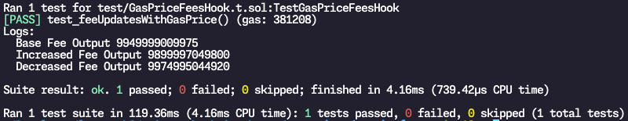

# Gas Price Based Fees

## Objective

In this lesson, we're going to build our first Dynamic Fees hook. Dynamic Fees are an interesting concept because it allows pools to adjust their competitiveness with other pools for the same token pair by adjusting how much swap fees is being charged. Hooks can be designed in different ways - to favour LPs or to favour swappers.

Today, we'll go with a simple idea - adjusting the fees charged depending on what the average gas price has been onchain. So, when transactions on ETH are $200, at least the swapper gets lower fees.

The full code for this hook is available here for review - https://github.com/haardikk21/gas-price-hook

## Mechanism Design

The idea here is simple. We will design a hook that keeps track of the moving average gas price over time onchain. When gas price is roughly equal to the average, we will charge a certain amount of fees. If gas price is over 10% higher than the average, we will charge lower fees. If gas price is at least 10% lower than the average, we will charge higher fees.

To make this a production-level system, you probably want to do some simple financial modelling to make sure that users aren't intentionally setting a higher gas price because the reduced fee actually is reducing their total cost lower than what it would've cost them if they just swapped at the average fees - but we won't worry about that too much right now and only focus on the concept of dynamic fees.

Our hook contract basically then just needs to do two things:

Keep track of the moving average gas price
For each swap, dynamically adjust the swap fees being charged
Dynamic Fees in v4
Before we start coding, let's get an understanding of how dynamic fees hooks work and what you need to do.

Remember that the `PoolManager` contains a mapping of all pools, which contains the pool's `Pool.State` struct. Within the `Pool.State` struct, there is `Slot0` - accessible via the `getSlot0()` function on the `PoolManager` if you are using `StateLibrary`.

One of the values that is part of `Slot0` is the `lpFee`. The fees charged on each swap are represented by this `lpFee` property. Normally, pools define an `lpFee` during initialization that cannot change. A dynamic fee hook, basically, has the capability to just update this property whenever it wishes to do so.

There are two ways of doing so:

1. in cases where fees should be updated once-per-block or less often than that, we use `PoolManager.updateDynamicLPFee`
2. in cases where fees should be updated for every single swap, we can just return an `OVERRIDE_FEE` value from `beforeSwap` instead

For Case (1), the hook can call the `updateDynamicLPFee` function on the `PoolManager` at any point - with the `PoolKey` and the new fee value like so:

```solidity
poolManager.updateDynamicLPFee(poolKey, NEW_FEES);
```

This function itself is fairly simple:

```solidity
function updateDynamicSwapFee(PoolKey memory key, uint24 newDynamicSwapFee) external {
    if (!key.fee.isDynamicFee() || msg.sender != address(key.hooks)) revert UnauthorizedDynamicSwapFeeUpdate();
    newDynamicSwapFee.validate();
    PoolId id = key.toId();
    pools[id].setSwapFee(newDynamicSwapFee);
}
```

It first makes sure that the pool is in fact a dynamic fee pool. This is defined during the pool initialization, and cannot be changed later. It also makes sure that the function caller is the hook attached to the pool, not some random address.

Then, the `.validate()` call simply makes sure the new fees isn't larger than the `MAX_SWAP_FEE` - which is 100%. As long as the swap fees is below 100%, the pools mapping is updated to represent the new swap fees.

For Case (2), we need to return the third argument from `beforeSwap` (instead of just letting it be zero). In this case, we need to return the new fee value along with the 23rd bit of that value being marked as `1` which signifies that `OVERRIDE_FEE_FLAG` is enabled. We'll use this for today's lesson so we'll see how it works in a bit.

So, in our case, since we want to charge a different fees for each swap depending on gas price - we will return an override fee inside `beforeSwap` - so the fee has been updated before the swap is executed. We'll also update our moving average gas price `afterSwap` for future swaps.

Let's start!

## Setting up Foundry

We know the drill - let's set up Foundry, install `v4-periphery`, set up remappings, and configure it.

```bash
# Initialize a new foundry project

forge init gas-price-dynamic-fees

# Install v4-periphery

cd gas-price-dynamic-fees
forge install Uniswap/v4-periphery

# Place remappings

forge remappings > remappings.txt

# Remove default Counter.sol files

rm ./\*_/Counter_.sol
```

Now, to configure `foundry.toml` - add the following to its end:

foundry.toml

```toml
solc_version = '0.8.26'
evm_version = "cancun"
optimizer_runs = 800
via_ir = false
ffi = true
```

Awesome - we can get started building our hook now!

## Creating GasPriceFeesHook.sol

Create a new file named GasPriceFeesHook.sol under the src/ directory - and write the following boilerplate.

GasPriceFeesHook.sol

```solidity
// SPDX-License-Identifier: MIT
pragma solidity ^0.8.0;

import {BaseHook} from "v4-periphery/src/base/hooks/BaseHook.sol";
import {IPoolManager} from "v4-core/interfaces/IPoolManager.sol";
import {Hooks} from "v4-core/libraries/Hooks.sol";
import {PoolKey} from "v4-core/types/PoolKey.sol";
import {BalanceDelta} from "v4-core/types/BalanceDelta.sol";
import {LPFeeLibrary} from "v4-core/libraries/LPFeeLibrary.sol";
import {BeforeSwapDelta, BeforeSwapDeltaLibrary} from "v4-core/types/BeforeSwapDelta.sol";

contract GasPriceFeesHook is BaseHook {
using LPFeeLibrary for uint24;

    // Keeping track of the moving average gas price
    uint128 public movingAverageGasPrice;
    // How many times has the moving average been updated?
    // Needed as the denominator to update it the next time based on the moving average formula
    uint104 public movingAverageGasPriceCount;

    // The default base fees we will charge
    uint24 public constant BASE_FEE = 5000; // 0.5%

    error MustUseDynamicFee();

    // Initialize BaseHook parent contract in the constructor
    constructor(IPoolManager _poolManager) BaseHook(_poolManager) {
    	// TODO
    }

    // Required override function for BaseHook to let the PoolManager know which hooks are implemented
    function getHookPermissions()
        public
        pure
        override
        returns (Hooks.Permissions memory)
    {
        return
            Hooks.Permissions({
                beforeInitialize: true,
                afterInitialize: false,
                beforeAddLiquidity: false,
                beforeRemoveLiquidity: false,
                afterAddLiquidity: false,
                afterRemoveLiquidity: false,
                beforeSwap: true,
                afterSwap: true,
                beforeDonate: false,
                afterDonate: false,
                beforeSwapReturnDelta: false,
                afterSwapReturnDelta: false,
                afterAddLiquidityReturnDelta: false,
                afterRemoveLiquidityReturnDelta: false
            });
    }

    function beforeInitialize(
        address,
        PoolKey calldata key,
        uint160,
        bytes calldata
    ) external pure override returns (bytes4) {
        // TODO
        return this.beforeInitialize.selector;
    }

    function beforeSwap(
        address,
        PoolKey calldata key,
        IPoolManager.SwapParams calldata,
        bytes calldata
    )
        external
        override
        onlyByPoolManager
        returns (bytes4, BeforeSwapDelta, uint24)
    {
        // TODO
        return (this.beforeSwap.selector, BeforeSwapDeltaLibrary.ZERO_DELTA, 0);
    }

    function afterSwap(
        address,
        PoolKey calldata,
        IPoolManager.SwapParams calldata,
        BalanceDelta,
        bytes calldata
    ) external override returns (bytes4, int128) {
    	// TODO
        return (this.afterSwap.selector, 0);
    }

}
```

Most of this should be fairly similar to what we've already seen. We enable three hook functions here - `beforeInitialize`, `beforeSwap`, and `afterSwap`.

We've briefly mentioned what we need `beforeSwap` and `afterSwap` for. For `beforeInitialize`, we will use it to ensure that no pool can be initialized with this hook attached that did not identify itself as a pool with dynamic fees - otherwise nobody will be able to conduct swaps on that pool.

## beforeInitialize

Let's fill this hook function out to verify the pool has dynamic fee enabled.

```solidity
function beforeInitialize(
    address,
    PoolKey calldata key,
    uint160,
    bytes calldata
    ) external pure override returns (bytes4) {
    // `.isDynamicFee()` function comes from using
    // the `SwapFeeLibrary` for `uint24`
    if (!key.fee.isDynamicFee()) revert MustUseDynamicFee();
    return this.beforeInitialize.selector;
}
```

That's all for this one - now we can move on to our main things.

## constructor

Initially when our hook contract is deployed, even before it's attached to a pool - we already have one transaction we can use to initialize our `movingAverageGasPrice`.

Since we'll be updating the moving average in a few different places, we'll split it up into a helper function we can just call. Let's create two helper functions:

```solidity
// Update our moving average gas price
function updateMovingAverage() internal {
uint128 gasPrice = uint128(tx.gasprice);

    // New Average = ((Old Average * # of Txns Tracked) + Current Gas Price) / (# of Txns Tracked + 1)
    movingAverageGasPrice =
        ((movingAverageGasPrice * movingAverageGasPriceCount) + gasPrice) /
        (movingAverageGasPriceCount + 1);

    movingAverageGasPriceCount++;

}
```

With this in place, let's update our constructor to be the first place we set our moving average:

```solidity
// Initialize BaseHook parent contract in the constructor
constructor(IPoolManager \_poolManager) BaseHook(\_poolManager) {
updateMovingAverage();
}
```

Detour - Assumptions and Notes

Our hook contract can only update its moving average when transactions are being made to it - and those transactions are calling the `updateMovingAverage` function as well, since it cannot look at transactions outside of itself.

Therefore, technically to have the most accurate tracking possible - we should enable every single hook function and if nothing else at least use them to update our moving average.

While that is trivial to do, we will not be doing that. The reason is simple - to focus on the concept of the idea, and just do it in places which are the most relevant for us right now.

With this said, let's move on to `beforeSwap`

## beforeSwap

Before a swap happens, we need to:

- Get the current gas price
- Compare current gas price with our moving average
- Calculate how much fees should be charged on this pool depending on if current gas price is higher or lower (and by how much)
- Update the swap fees in the pool manager

The third bullet point - figuring out how much fees to be charged - is something we can get fancy about. You can have all sorts of polynomial curves to figure this out. In our case, we're going to keep it relatively simple. Let's write a helper for that first, before implementing the hook function:

```solidity
function getFee() internal view returns (uint24) {
    uint128 gasPrice = uint128(tx.gasprice);

    // if gasPrice > movingAverageGasPrice * 1.1, then half the fees
    if (gasPrice > (movingAverageGasPrice * 11) / 10) {
        return BASE_FEE / 2;
    }

    // if gasPrice < movingAverageGasPrice * 0.9, then double the fees
    if (gasPrice < (movingAverageGasPrice * 9) / 10) {
        return BASE_FEE * 2;
    }

    return BASE_FEE;

}
```

This should be fairly self-explanatory. With this in place, let's write our `beforeSwap` function:

```solidity
function beforeSwap(
    address,
    PoolKey calldata key,
    IPoolManager.SwapParams calldata,
    bytes calldata
)
    external
    override
    onlyByPoolManager
    returns (bytes4, BeforeSwapDelta, uint24)
{
    uint24 fee = getFee();
    // If we wanted to generally update LP fee for a longer-term than per-swap
    // poolManager.updateDynamicLPFee(key, fee);

    // For overriding fee per swap:
    uint24 feeWithFlag = fee | LPFeeLibrary.OVERRIDE_FEE_FLAG;
    return (this.beforeSwap.selector, BeforeSwapDeltaLibrary.ZERO_DELTA, feeWithFlag);

}
```

## afterSwap

Finally, after a swap is done - we can update our moving average now for whenever the next swap happens. This is a fairly simple function as well:

```solidity
function afterSwap(
    address,
    PoolKey calldata,
    IPoolManager.SwapParams calldata,
    BalanceDelta,
    bytes calldata
) external override returns (bytes4, int128) {
    updateMovingAverage();
    return (this.afterSwap.selector, 0);
}
```

At this point - we're actually done with our hook!

Again - for more accurate tracking, you ideally want to enable every single hook function and track gas prices the most amount of times you can. But for our simple example showcase - this is good enough to test out our logic.

## Testing the Hook:

Create a new file named `GasPriceFeesHook.t.sol` under the `test/` directory.

Now, let's set up the boilerplate for the tests.

GasPriceFeesHook.t.sol

```solidity
// SPDX-License-Identifier: MIT
pragma solidity ^0.8.0;

import {Test} from "forge-std/Test.sol";
import {Deployers} from "@uniswap/v4-core/test/utils/Deployers.sol";
import {MockERC20} from "solmate/src/test/utils/mocks/MockERC20.sol";
import {PoolManager} from "v4-core/PoolManager.sol";
import {IPoolManager} from "v4-core/interfaces/IPoolManager.sol";
import {Currency, CurrencyLibrary} from "v4-core/types/Currency.sol";
import {PoolId, PoolIdLibrary} from "v4-core/types/PoolId.sol";
import {LPFeeLibrary} from "v4-core/libraries/LPFeeLibrary.sol";
import {PoolKey} from "v4-core/types/PoolKey.sol";
import {Hooks} from "v4-core/libraries/Hooks.sol";
import {PoolSwapTest} from "v4-core/test/PoolSwapTest.sol";
import {GasPriceFeesHook} from "../src/GasPriceFeesHook.sol";
import {TickMath} from "v4-core/libraries/TickMath.sol";
import {console} from "forge-std/console.sol";

contract TestGasPriceFeesHook is Test, Deployers {
using CurrencyLibrary for Currency;
using PoolIdLibrary for PoolKey;

    GasPriceFeesHook hook;

    function setUp() public {
    	// TODO
    }

}
```

## setUp

In the set up, we do the same things we usually do. Deploy v4-core contracts, mint some tokens, deploy our hook, initialize a new pool, and add some liquidity to the pool.

One thing that's slightly different is to make future tests a bit simpler, and test that our moving average is updated inside the `constructor`, we'll deploy our hook by setting the gas price to 10 gwei (the default in Foundry is to use 0 gas price).

```solidity
function setUp() public {
// Deploy v4-core
deployFreshManagerAndRouters();

    // Deploy, mint tokens, and approve all periphery contracts for two tokens
    deployMintAndApprove2Currencies();

    // Deploy our hook with the proper flags
    address hookAddress = address(
        uint160(
            Hooks.BEFORE_INITIALIZE_FLAG |
                Hooks.BEFORE_SWAP_FLAG |
                Hooks.AFTER_SWAP_FLAG
        )
    );

    // Set gas price = 10 gwei and deploy our hook
    vm.txGasPrice(10 gwei);
    deployCodeTo("GasPriceFeesHook", abi.encode(manager), hookAddress);
    hook = GasPriceFeesHook(hookAddress);

    // Initialize a pool
    (key, ) = initPool(
        currency0,
        currency1,
        hook,
        LPFeeLibrary.DYNAMIC_FEE_FLAG, // Set the `DYNAMIC_FEE_FLAG` in place of specifying a fixed fee
        SQRT_PRICE_1_1,
        ZERO_BYTES
    );

    // Add some liquidity
    modifyLiquidityRouter.modifyLiquidity(
        key,
        IPoolManager.ModifyLiquidityParams({
            tickLower: -60,
            tickUpper: 60,
            liquidityDelta: 100 ether,
            salt: bytes32(0)
        }),
        ZERO_BYTES
    );

}
```

The `vm.txGasPrice` is a cheat code in Foundry that allows us to update the gas price for the calls that occur after it. Since we're doing this in `setUp` - the default gas price will be 10 even inside the test function we write later.

Also, we initialize our pool with `SwapFeeLibrary.DYNAMIC_FEE_FLAG` as the argument to the `fee` parameter. This is just a "special" fee value that tells v4 this pool has support for dynamic fees. The actual value for this is `0x800000`

Now, let's create a test.

## test_feeUpdatesWithGasPrice

Since Foundry doesn't persist smart contract state between different test functions, we'll resort to just writing one relatively long test today.

Before we write the code, let me lay an outline for what we're going to do so it makes some high-level sense:

1. First, we'll ensure that the current moving average gas price is set to 10 gwei - as that is what was initially set when the hook was deployed
2. We'll then conduct a swap at gas price exactly = 10 gwei, and this should charge us the BASE_FEE and should keep the moving average at 10 gwei.
3. Then, we'll do a second swap - this time at 4 gwei - which should trigger higher fees in case of low gas prices. Also, it should update the moving average from 10 to 8 gwei now.
4. Then, we'll do a third swap - this time at 12 gwei - which should trigger lower fees in case of high gas prices. Also, it should update the moving average from 8 to 9 gwei now.

We'll also keep our swap amounts very small compared to the available liquidity so that the difference between the output amount of tokens we get back from the swap isn't because the price has shifted too much.

With this flow in mind, here's the code for the test - with comments separating the different sections:

```solidity
function test_feeUpdatesWithGasPrice() public {
    // Set up our swap parameters
    PoolSwapTest.TestSettings memory testSettings = PoolSwapTest
        .TestSettings({takeClaims: false, settleUsingBurn: false});

    IPoolManager.SwapParams memory params = IPoolManager.SwapParams({
        zeroForOne: true,
        amountSpecified: -0.00001 ether,
        sqrtPriceLimitX96: TickMath.MIN_SQRT_PRICE + 1
    });

    // Current gas price is 10 gwei
    // Moving average should also be 10
    uint128 gasPrice = uint128(tx.gasprice);
    uint128 movingAverageGasPrice = hook.movingAverageGasPrice();
    uint104 movingAverageGasPriceCount = hook.movingAverageGasPriceCount();
    assertEq(gasPrice, 10 gwei);
    assertEq(movingAverageGasPrice, 10 gwei);
    assertEq(movingAverageGasPriceCount, 1);

    // ----------------------------------------------------------------------
    // ----------------------------------------------------------------------
    // ----------------------------------------------------------------------
    // ----------------------------------------------------------------------

    // 1. Conduct a swap at gasprice = 10 gwei
    // This should just use `BASE_FEE` since the gas price is the same as the current average
    uint256 balanceOfToken1Before = currency1.balanceOfSelf();
    swapRouter.swap(key, params, testSettings, ZERO_BYTES);
    uint256 balanceOfToken1After = currency1.balanceOfSelf();
    uint256 outputFromBaseFeeSwap = balanceOfToken1After -
        balanceOfToken1Before;

    assertGt(balanceOfToken1After, balanceOfToken1Before);

    // Our moving average shouldn't have changed
    // only the count should have incremented
    movingAverageGasPrice = hook.movingAverageGasPrice();
    movingAverageGasPriceCount = hook.movingAverageGasPriceCount();
    assertEq(movingAverageGasPrice, 10 gwei);
    assertEq(movingAverageGasPriceCount, 2);

    // ----------------------------------------------------------------------
    // ----------------------------------------------------------------------
    // ----------------------------------------------------------------------
    // ----------------------------------------------------------------------

    // 2. Conduct a swap at lower gasprice = 4 gwei
    // This should have a higher transaction fees
    vm.txGasPrice(4 gwei);
    balanceOfToken1Before = currency1.balanceOfSelf();
    swapRouter.swap(key, params, testSettings, ZERO_BYTES);
    balanceOfToken1After = currency1.balanceOfSelf();

    uint256 outputFromIncreasedFeeSwap = balanceOfToken1After -
        balanceOfToken1Before;

    assertGt(balanceOfToken1After, balanceOfToken1Before);

    // Our moving average should now be (10 + 10 + 4) / 3 = 8 Gwei
    movingAverageGasPrice = hook.movingAverageGasPrice();
    movingAverageGasPriceCount = hook.movingAverageGasPriceCount();
    assertEq(movingAverageGasPrice, 8 gwei);
    assertEq(movingAverageGasPriceCount, 3);

    // ----------------------------------------------------------------------
    // ----------------------------------------------------------------------
    // ----------------------------------------------------------------------
    // ----------------------------------------------------------------------

    // 3. Conduct a swap at higher gas price = 12 gwei
    // This should have a lower transaction fees
    vm.txGasPrice(12 gwei);
    balanceOfToken1Before = currency1.balanceOfSelf();
    swapRouter.swap(key, params, testSettings, ZERO_BYTES);
    balanceOfToken1After = currency1.balanceOfSelf();

    uint outputFromDecreasedFeeSwap = balanceOfToken1After -
        balanceOfToken1Before;

    assertGt(balanceOfToken1After, balanceOfToken1Before);

    // Our moving average should now be (10 + 10 + 4 + 12) / 4 = 9 Gwei
    movingAverageGasPrice = hook.movingAverageGasPrice();
    movingAverageGasPriceCount = hook.movingAverageGasPriceCount();

    assertEq(movingAverageGasPrice, 9 gwei);
    assertEq(movingAverageGasPriceCount, 4);

    // ------

    // 4. Check all the output amounts

    console.log("Base Fee Output", outputFromBaseFeeSwap);
    console.log("Increased Fee Output", outputFromIncreasedFeeSwap);
    console.log("Decreased Fee Output", outputFromDecreasedFeeSwap);

    assertGt(outputFromDecreasedFeeSwap, outputFromBaseFeeSwap);
    assertGt(outputFromBaseFeeSwap, outputFromIncreasedFeeSwap);

}
```

Let's try running this with forge test - and you should see the tests pass!

To see the console.log output from the tests, run the command with forge test -vv to enable some verbosity from the output - and you should see something like this:

Forge Test Screenshot


Great - with this, we've successfully implemented our first little dynamic fee hook!

## Conclusion

Hopefully this module felt somewhat simple. The goal for this was to move into a completely different category of hooks that is dynamic fees.

The next topic will be Limit Orders, which is definitely bit of a step up in terms of difficulty - but don't worry, we'll spend 2 workshops covering it in detail, and then come back to dynamic fees after that.

The next dynamic fees topic we touch will be Nezlobin's Directional - which will bring us back to a relatively more complex version of dynamic fees that can help improve market efficiencies.

For now though, hopefully you learnt some new things and have understood how the concept of dynamic fee pools work. As always, if you have any questions - feel free to ask during the workshops, office hours, or on the group.

Until next time!
