# Dynamic fees: Nezlobin's Directional Fee

## Intro and Objectives

### Lesson Objectives

- Learn about impermanent loss
- Understand the impact of swap fees on price efficiency and market resilience
- Learn how arbitrageurs cause impermanent losses for LPs
- Explore Nezlobin's ideas in mitigating impermanent loss through the use of dynamic fees
- Get inspiration for Capstone project ideas

### Introduction

Continuing with the Dynamic Fees topic, today we're going to take a look at a mechanism design proposed by Alexander Nezlobin called, to his namesake, the Nezlobin Directional Fee. We'll dig into impermanent loss, the causes of impermanent loss, how big of a problem it is, and how can we help mitigate it through the use of dynamic fee hooks.

This is a conceptual topic. We will not be writing code. Rather, the lesson is diving into the concepts required to understand the mechanism with some pointers on how you can build it yourself. This lesson is also a valid idea to use for your capstone project.

Nezlobin’s Directional Fee
Shoutout
This whole lesson is based on work produced by Alexander Nezlobin, a Professor of Accounting at the London School of Economics who also blogs a lot about DeFi. If you'd like to look at his original blogs on this topic, the links are here:

1. https://medium.com/@alexnezlobin/toxic-order-flow-on-decentralized-exchanges-problem-and-solutions-a1b79f32225a
2. https://medium.com/@alexnezlobin/how-resilient-is-uniswap-v3-81bc548a0312
3. https://medium.com/@alexnezlobin/executing-large-trades-with-range-orders-on-uniswap-v3-a4a5e4debb67
4. https://medium.com/@alexnezlobin/solving-order-flow-toxicity-d388126cf69a

## Impermanent Loss

Alright, so let's get started first with discussing impermanent loss. Most of you are probably already familiar with this concept, but we will do a quick recap.

Impermanent loss is loss faced by liquidity providers on an AMM that occurs when relative prices of assets in a pool change such that they are not in favour of the LP. The word "impermanent" here is relevant for two reasons. Firstly, the loss isn't realized unless the LP withdraws the liquidity from the AMM. If they keep it there, prices may shift again in the future such that they break even or even profit from their position. Secondly, the loss they're incurring is "potential loss". That is, had they just held the tokens instead of using them as liquidity, they would have had more money. It's a form of opportunity cost, not them actually losing a % of the tokens they put in as liquidity.

We'll understand this concept with an example. For demonstration without loss of generality, we'll assume a full-range AMM pool (Uniswap v2 style):

Assume an ETH/DAI pool exists. Current price is 1 ETH = 100 DAI. There is 95 ETH and 9,500 DAI in the pool total.

Alice comes around and adds 5 ETH + 500 DAI in liquidity to the pool to become an LP. The pool now has a total of 100 ETH and 10,000 DAI in it. As a result, she is issued a receipt token saying she owns 5% of the pool's reserves she can withdraw at a later point.

Bob, a trader, comes by and buys 10 ETH from the pool. We can solve for `xy = k` and deduce that Bob would need to pay 1111.11… DAI for his 10 ETH. Also, he would leave the pool in a state where the pool now has 90 ETH + 11,111.11… DAI as reserves.

Calculating the spot price of 1 ETH at current reserves, `y/x`, will give us 1 ETH = ~124 DAI.

Alice, who owns 5% of the pool's reserves, now has claim over 5% of 90 ETH and 5% of 11,111.11 DAI i.e. 4.5 ETH and 555.555 DAI. At the current spot price of 1 ETH = 124 DAI, this is equivalent to ~1113.8 USD for Alice.

If Alice had chosen not to add liquidity, and under the assumption that Bob would have done his trade regardless and moved ETH price to 124 DAI anyway, she would still have 5 ETH + 500 DAI which would equate to (5 \* 124) + 500 = 1120 USD.

Therefore, had Alice chosen not to become an LP, she would've had more money than she does now that she did choose to become an LP. This is the concept of impermanent loss.

Again, note that Alice can continue to keep her funds in the pool, and over time as price keeps shifting she no longer is in the red, hence the word impermanent. Also note that Alice's percentage ownership of the pool's reserves did not change. She "lost out" on potentially another ~6 dollars by choosing to LP, but didn't actually "lose" share of the pool reserves.

## Problems of Impermanent Loss

With Uniswap v3 and concentrated liquidity, markets became more capital efficient which helped with impermanent loss, but not completely free of it. Importantly, it is impossible to bring impermanent loss down to zero - since LPs do take upon risk by becoming a market marker which is why they earn rewards through swap fees. If they make a bad bet, they lose money. If they make a good bet, they make money. The goal is not to have zero impermanent loss, as that would mean being able to earn rewards with zero risk and that's not sustainable. The goal is to simply reduce or mitigate the impermanent loss as much as we can to improve incentives to become an LP.

But, how big a problem is this really?

To answer that we will take a look at [this paper](https://sites.google.com/site/alexanderanezlobin/alexander-nezlobin). The paper analyzed 17 pools which covered 43% of the TVL on Ethereum L1 over a certain time period. Total fees earned during that time period until the cut off date was ~$200 million, but total impermanent loss was ~$260 million. Had LPs just held their tokens, theoretically, they would have ~$60 million more.

This doesn't paint the full picture though as there are a couple of important sidenotes here.

1. LPs "losing" money on average is not the same as all LPs losing money
2. Several LPs out there also make money
3. LPs inherently take upon risk by choosing to become a market maker. It's a similar opportunity cost as you choosing to sell your ETH when you think the price has hit a local top, and after you sell it, it turns out the price kept going up anyway. You "lost out" on more money, but didn't "actually" lose money.

## Toxic Order Flow

With IL out of the way, we'll take a bit of a detour onto a second topic and understand the concept of Toxic Order Flow. This is mostly just terminology.

Order flow is considered toxic when it is primarily dominated by well-informed arbitrageurs. The word well-informed here refers to what is colloquially talked about as "smart money". The proverbial day trader with 6 monitors tracking every news article and looking at 10 different exchanges and running bots to try to profit off of every little inconsistency.

The opposite of well-informed arbitrageurs are uninformed traders. Uninformed traders are "the average Joe" - someone who is trading on a DEX because they need the other asset to do something most likely. They're generally not very price sensitive, i.e. getting $1 more or less for their ETH doesn't really sway their decision. They also are not trying to time the markets and instead just going about their day, metaphorically speaking.

The paper we looked at above showed that large orders on Uniswap were primarily dominated and being conducted by well-informed arbitrageurs who only trade on the platform when they identify inefficiencies. In designing their trades, arbitrage bots make sure they are profitable net all their costs (gas fees, swap fees, MEV fees, etc.). But since it's a zero-sum game, someone has to lose money - and in this case, it's the LPs who take the loss (or, impermanent loss more accurately).

For example, let's say ETH is selling for $100 on Uniswap, but trading for $102 on Coinbase. A large well-informed arbitrageur can do a hedge transaction on Coinbase and buy a lot of ETH from Uniswap to sell there, making sure they make money net all their costs. But, LPs on Uniswap face impermanent loss here because the ETH they provided as liquidity is getting swapped to the stablecoin at a spot price of $100, when in fact it is $102 which is the price they could've gotten had they not LP'd their money.

Arbitrageurs leaving LPs holding the short end of the stick is why we refer to this as toxic order flow. To solve for it, we have two options:

1. Make arbitrage trading more costly to deter arbitrageurs or possibly redistribute the additional revenue from fees they have to pay back to LPs as a way to compensate them
2. Attract more uninformed trading volume to the exchange

Through the rest of this lesson, we are going to understand how both of these options can be implemented through the use of dynamic fees. But first, we need to truly understand the problem by looking at how fees play a role at all in this overall scenario.

## Large Trading Volume

We'll first analyze how large trades occur on centralized exchanges, and then look at the equivalent on Uniswap to understand the different behaviour and its affects.

### Large Order Execution on a CEX

Most centralized exchanges operate as a Central Limit OrderBook (CLOB). Let's start by taking a look at how large trades work there, what options do traders have to minimize price impact while conducting large trades, and how market makers are affected. All following screenshots and diagrams are from Nezlobin's original blog post from 2022.

The following is the order book from Binance for the top 100 bids and asks for ETH/USDT.

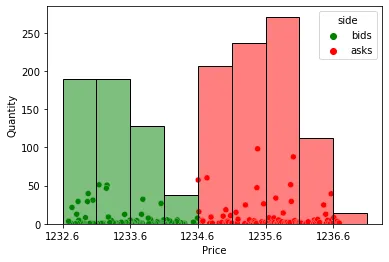

> [!NOTE] Reminder
> Bids = price someone is willing to pay you for your ETH (buying price) - Asks = price someone is willing to sell you their ETH for (selling price)

Each "dot" in the diagram refers to a limit order placed at a given price for a given quantity. We can see that the best bid is for 1234.59 USDT, and the best ask is at 1234.60 USDT, implying a spread of 0.01 USDT between the buying and selling price.

The leftmost red bar (Asks) shows we have slightly over 200 ETH for sale in the 1234.6 to 1235.1 USDT price range.

Let's say Alice wants to execute a large order to purchase 800 ETH from this orderbook (roughly the volume from the first four red bars in the diagram).

If Alice does a market buy order for 800 ETH, she will consume the first four bars of liquidity, and her average execution price will be ~1235.5 USDT. This is 7 basis points (0.07%) higher than the spot price of 1234.6 USDT (not great).

#### Multiple Smaller Market Buys

Alternatively, Alice could break her order into multiple smaller orders over time. Let's say she places an order to market buy 200 ETH instead of 800. She consumes the first red bar of liquidity and her average execution price is 1234.75 USDT which is only 1 basis point higher than the spot price.

The new orderbook, after her swap, looks like this:

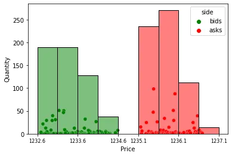

The first red bar of liquidity is consumed.

If Alice was an uninformed trader and the "global" efficient price of ETH/USDT is still 1234.6 USDT per ETH, the order book will be refilled again and liquidity will be added again to the orderbook making the spot price return back to 1234.6.

Then, Alice can do it again, and so on and so forth - ending up buying 800 ETH at an average execution price only 1 bps higher than spot.

The speed at which the order book is refilled and price returns back to the mid-price after an uninformed trade occurs is called **market resilience**. Order books on large centralized exchanges like Binance are highly resilient and usually refill in milliseconds.

#### Multiple Limit Buys

Alice has another way to purchase her 800 ETH. Instead of submitting market buys, she could add to the bid side of the orderbook and place a limit order to buy her ETH for <1234.60 USDT. The dark green part in the following diagram shows her submitting a limit order to purchase ~200 ETH at an average price of 1234.35 USDT.

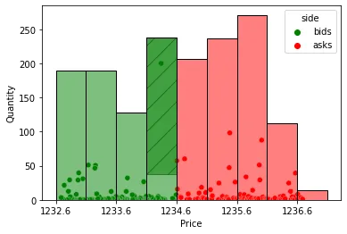

In this case, Alice hopes that her order will be filled, and she will actually save 2 bps relative to the current spot price.

However, she also takes on risk. The price of ETH could go up, leaving her order unfulfilled (non-execution risk). Or, the price can suddenly go down, and an arbitrageur can submit a sell order to sell to her before she can cancel her buy, making her buy ETH at a higher price than the "new" spot price (pick off risk).

To solve for both Alice can monitor her orders closely and be extremely efficient with updating her orders i.e. basically become a well-informed trader. This strategy is easier to do on CEXes since folks can write bots which make API calls with millisecond latency, but harder on DEXes due to onchain processing of transactions and gas costs.

## Uniswap's Competitiveness

The question, now, is how competitive is Uniswap to these CEXes? If Alice wanted to do a large trade on Uniswap instead, how resilient is the AMM compared to the CEX?

Let's look at an ETH/USDC pool on the AMM. We'll represent the different liquidity positions that exist as an orderbook to draw easier analogies. Let's say we have a pool where 1 ETH = 1000 USDC at the current spot price, and ~200 ETH of liquidity at the different price ranges.

In theory, the resilience for this market is quite high.

If Alice wanted to buy 1000 ETH in a single swap, she would consume the five red bars of ETH liquidity at an average execution price of 1002.5 USDC which is 25 bps > spot price.

Instead, if she places multiple smaller 200 ETH orders, let's see how competitive that strategy is. She buys 200 ETH, and the new orderbook looks like this:

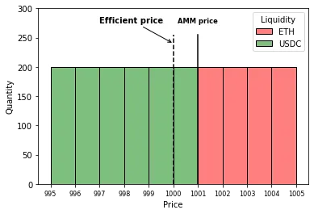

Note that the USDC she paid for her ETH immediately got added to the bid side of the market. The pool's reserves have changed with the new AMM spot price being 1 ETH = 1001 USDC, and new USDC has been put up for sale.

Theoretically if Alice is an uninformed trader and the efficient market price of ETH is still 1000 USDC elsewhere, an arbitrageur will come in and rebalance the pool to look like it's original state. After that, Alice can buy another 200 ETH, and so on and so forth, averaging at an execution price of just 1000.5 USDC per ETH.

**BUT**, things are not so rosy in reality. The above diagrams assume there is no price spread between bids and asks on the AMM - but that's not really true. Due to swap fees that are charged, there is in fact a spread.

Let's say the ETH/USDC pool has a 30 bps fees (0.3%) on each swap. Taking that into account, the pool's liquidity actually looks like this:

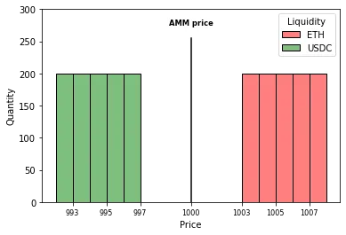

1 ETH can be purchased for 1003 USDC, or sold for 997 USDC.

If Alice buys 200 ETH from this pool it would look like:

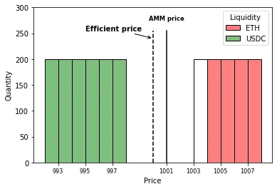

The new AMM mid price is at 1001 USDC. 1 ETH can be bought from the AMM for 1004 USDC, and sold for 998. If Alice is uninformed and the efficient price of ETH is still 1000 USDC on other liquidity sources - what do you think happens?

Should we expect an arbitrageur to come in and rebalance the pool in the above diagram assuming they can purchase 1000 ETH at an alternative liquidity source at a price of 1000 USDC each?

If you answered "No" to the above question - you're correct.

To move the AMM mid price back to 1000, an arbitrageur would need to sell back 200 ETH to the protocol. If they do this, their average execution price will be 997.5 USDC after swap fees. This is unprofitable for the arbitrageur since they're buying their ETH for 1,000 USDC each at the alternative liquidity source. No half-decent arbitrageur will take this deal.

So then what? The pool remains in an "inefficient" state. Stuck at a mid price that does not match up with the global efficient price.

For an arbitrageur to come and resolve the discrepancy the price needs to shift even more and the pool needs to become even more inefficient. Only then can the arbitrageur sell ETH into the pool and walk away with an average execution price of >1000 USDC AFTER taking swap fees into account.

The only other option to bring the pool back to an efficient state, without waiting for the situation to get worse first, is to drive more uninformed trading volume to the pool who can sell ETH into the pool at a spot price of 998 USDC per ETH and by doing so rebalance the pool in the process.

**Takeaway**: In an AMM that charges swap fees, informed market participants do not have an incentive to push the mid-price to the efficient level unless the AMM price deviates from more than the swap fees being charged.

## But CEXs also charge fees?

Yes, but let's understand the difference.

Consider an orderbook that has the same fee structure - 30 bps from the taker. Initially, the orderbook looks similar to the AMM:

If Alice buys 200 ETH here, the order book becomes:

First key difference here is that Alice's USDC did not immediately get put up for sale on the bid side unlike the AMM.

Bob can go to a different liquidity source where price is still 1000 USDC (and assuming similar 30 bps fees there), purchase 200 ETH for (1000 + 3) USDC each, and place an order to sell 200 ETH on this orderbook effectively replacing the liquidity that Alice consumed at an average price of 1003-1004 USDC taking fees into account thereby getting an average execution price of 1003.5 USDC and making a little bit of profit.

Second key difference, therefore, is that orderbooks make it possible to shift the spot price by adding/removing liquidity to the orderbook (placing orders). This is not possible in an AMM, since addition or removal of liquidity in an AMM can only affect liquidity depth, but not the relative price of the assets.

**Therefore**, AMMs rely exclusively on traders for price discovery. These traders only have incentives to rebalance a pool stuck in an inefficient state when the price deviation there is greater than the amount of the swap fees they will be charged.

As a result, uninformed traders who want to execute large swaps get a worse deal on AMMs on average compared to CEXes since they cannot simply split their trade into smaller orders as efficiently as an order book.

And as a result of that, large trades on AMMs tend to be dominated only by arbitrageurs (not regular users) who are only doing those AFTER a pool has been inefficient long enough for them to come in and rebalance while being able to make a profit.

This situation then, overall, causes toxic order flow.

## Building a low toxicity AMM

So to quickly recap:

- Toxic order flow is when order flow is largely dominated by well-informed arbitrageurs
- Toxic order flow causes LPs to face higher levels of impermanent losses
- The large domination of arbitrageurs exists because executing large swaps on an AMM is generally worse for uninformed traders than doing it on a CEX, therefore mostly only arbitrageurs are doing large trades on the AMM
- Our goal is twofold - make toxic order flow more expensive, and make it cheaper for uninformed traders to use the AMM so we don't need to wait for arbitrageurs in the first place

**Nezlobin's Directional Fee** is the idea that involves using dynamic fees in AMM pools to create an AMM that has incentives for moving the AMM mid price back to the efficient price. His original work predates Uniswap v4 and proposes building a brand new AMM from scratch. But, with Uniswap v4 and hooks, we can do this much more simply by building a dynamic fee hook instead.

Let's understand the concept first.

Consider an ETH/USDC pool which charges `f` amount in swap fees.

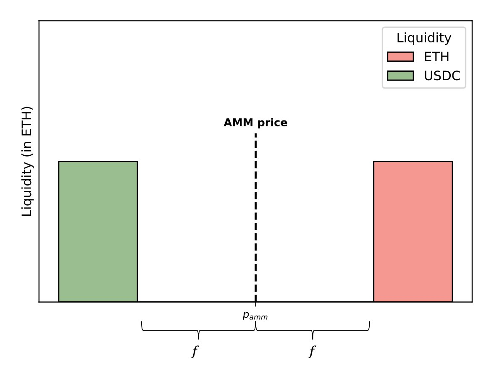

The orderbook representation of the pool looks like above, where `P_amm` refers to the pool's mid price. It is possible to purchase ETH starting from `P_amm + f`, and sell ETH starting from `P_amm - f`.

Let's say the price of ETH at an alternative liquidity source jumps up to `P*`, causing an arbitrageur to come in and buy a bunch of ETH from this AMM in the price range of `P_amm + f` to `P*`

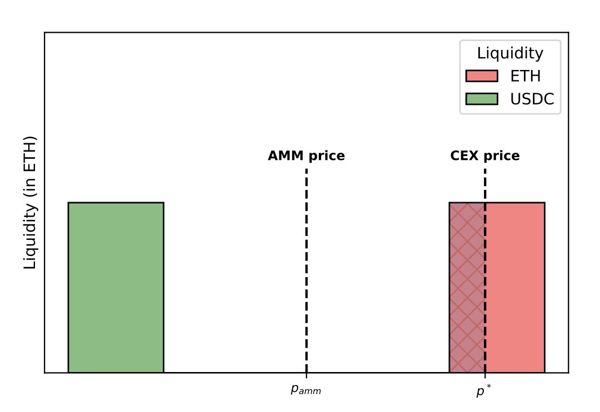

This causes the new orderbook of the AMM to look like:

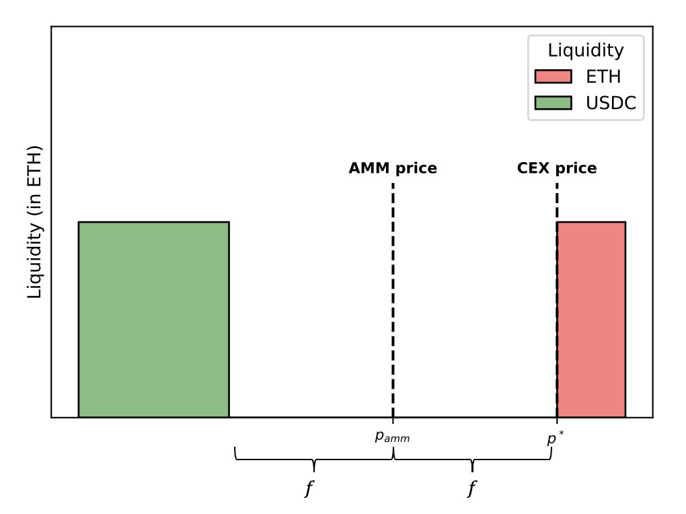

This causes the AMM mid price to shift to the right a little bit, and additional USDC being added to the bid side of the market. The overall price spread of the AMM is still 2f, but ETH can be purchased for `P*` while being sold for `P_amm - f`.

In this case, the pool is now stuck in an inefficient state where it's quoting a lower price than the efficient price. Assuming the "CEX Price" (alt liquidity source price) is more efficient, the AMM price is lagging behind. Purchasing ETH from the AMM is a good deal, but selling ETH into the AMM is a pretty bad deal. The ask side (buying ETH) will be picked off quickly, and the bid side is way too far for any informed trader to use. LPs will therefore build up impermanent losses and a push back is not expected in the opposite direction to prevent that from happening.

If we could wave a magic wand, it would be wonderful if the AMM mid price moved further to the right, enabling better prices for sellers, and a higher price for buyers to compensate LPs more fairly.

Reiterating the diagrams with an example:

- Assume originally 1 ETH = 1000 USDC, and pool charging 30 bps fees
- `P_amm` = 1000, `P_amm + f` = 1003, `P_amm - f` = 997
- Efficient price shifts to 1004 on alternative liquidity sources
- Arbitrageur buys from AMM for 1003, sells on CEX for 1004
- AMM now has `P_amm` = 1001, `P_amm + f` = 1004, `P_amm - f` = 998
- Buying ETH on AMM is a good deal for traders but a bad deal for LPs
- Selling ETH on AMM is a bad deal for traders, so those swaps are not expected to happen immediately
- Ideally: We want to increase `P_amm` a bit to move the mid price closer to the efficient price, improve the efficiency of selling ETH into the pool, and make it more expensive to keep buying ETH from the pool

BUT, respecting the rules of the AMM pricing curve, we cannot magically shift `P_amm` - that can only happen through swaps that take place.

What we can do though, with hooks, is change the amount of fees charged for the swaps that ARE happening.

Theoretically, we can raise the fees for ETH buys by some amount `d`, and lower the fees for ETH sales by `d`. Now the spread is no longer symmetrical, but is still a total spread of `2f`.

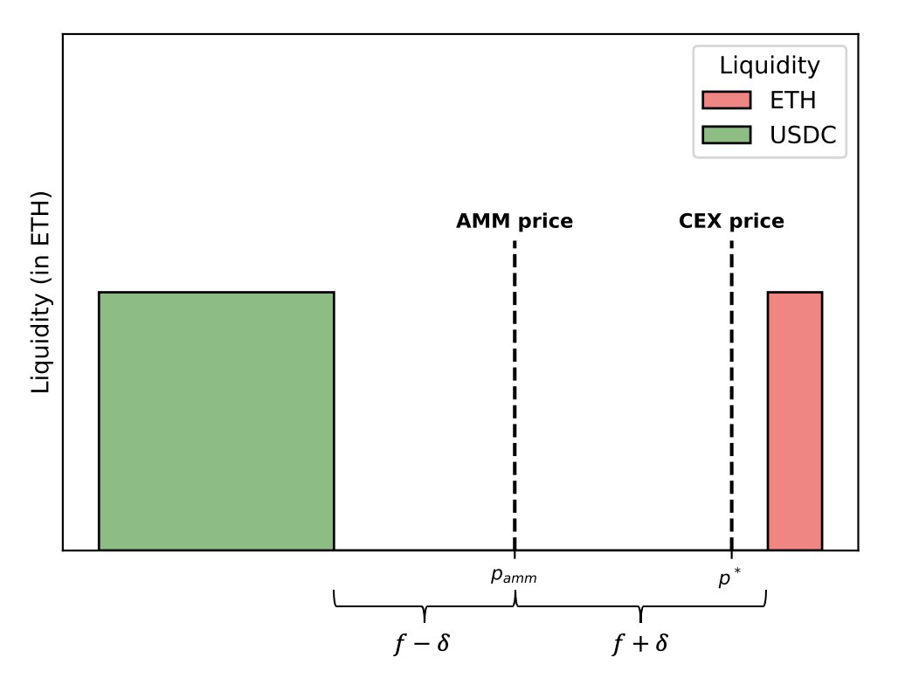

You may ask why this works?

The swap direction of arbitrage is generally highly correlated. If the market price is pushing the ask price on the AMM, it is likely to continue doing that for a while rather than pushing the bid price. Since selling into the pool is a bad deal, large traders don't want to sell into the pool. But, large traders may want to continue buying from the pool since that's a good deal for them - but that hurts the LPs since the mid price is what should be at the efficient price, not the mid price + fees. For the pool to come back to an efficient state, the AMM will need to stay inefficient until enough buys happen such that the mid price deviates even further and then an arbitrageur comes back to rebalance it. Therefore, increasing fees on transactions that keep pushing the ask helps by making it more expensive for arbitrageurs to keep hurting LPs, and decreasing fees on transactions that push the bid makes it better for traders who want to sell large amounts of ETH into the pool making it better positioned to compete against alternative liquidity sources.

Nezlobin ran a simple Python simulation - https://github.com/alexnezlobin/simulations

He considered an ETH/USDC pool, 1 ETH = 2000 USDC spot, with $50k of liquidity per tick and 0.05% swap fees. At the top of each block, he adjusted the fees by 75% of the price impact from the previous block. The results were interesting:

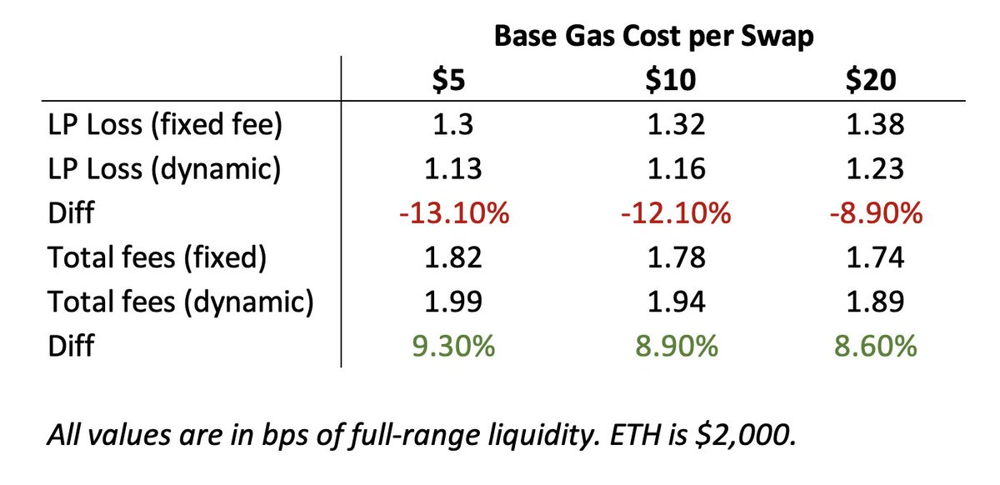

LP losses were reduced by up to 13.1%, and total fees earned by LPs was increased by up to 9.2%. Again - impermanent loss is not zero, and that's not even the goal - but the amount of mitigation is quite impressive.

## Mechanism Design

So, how do we build this?

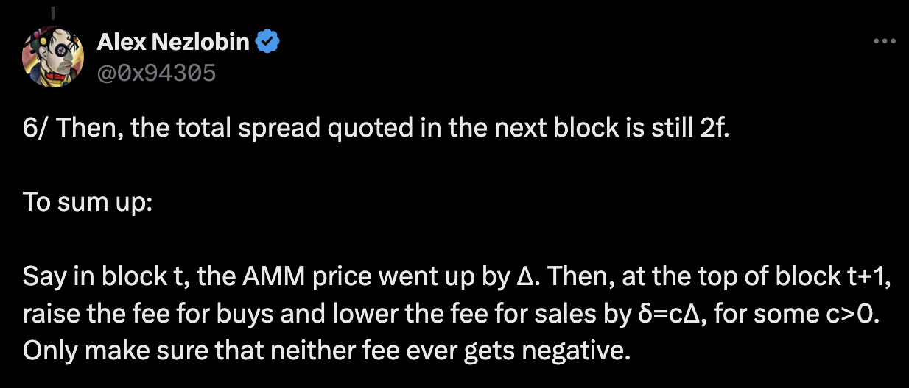

The above tweet basically covers the mechanism design. Basically, we need to keep track of the price impact on a per-block basis. If the price went up, we raise the fee for buys and lower the fee for sales by a value `c * Delta` for some `c > 0` while making sure that `f - c*Delta` never gets negative.

Now let's turn on our engineering brain and think of it from the perspective of code. If we were to do this as a dynamic fee hook, we have a few challenges to solve for:

1. How do we know we're at the top of the block `t + 1`?
2. How should we track the price movement of the AMM per block?
3. How do we pick a value for c such that the adjusted fee never gets negative?

#### Q1. Identifying we're at top of block t+1?

We can use either `block.timestamp` or `block.number` as a way to keep track of blocks we've seen before (from the context of a single transaction) and ones we haven't. Both work fine as they're both monotonically increasing numbers. In the following example I'll assume using the timestamp, but the block height is also fine.

First, we maintain a value for `blockTimestampLast` in the hook's storage. If we want to make a general purpose hook to work with multiple pools, we can make this a mapping from `PoolId ⇒ blockTimestampLast` instead. We initialize the value for this inside `beforeInitialize` or `afterInitialize` for anytime a new pool is created with our hook attached.

Then, inside `beforeSwap`, we can create a conditional which checks `if block.timestamp > blockTimestampLast`. If it is, we are in a new block - and we can run our "top of block" logic here. This is where we should calculate a value for `c` and track the price impact Delta and save those to the hook's storage as well. Then, we update `blockTimestampLast` so that we don't enter this conditional again until the first relevant transaction from the next block.

Outside the conditional, we use the saved values of `c` and `Delta` on a per-swap basis to adjust the pool's dynamic fee value (either increase it or decrease it around a given base fee `f`) based on looking at the direction of the swap through the swap parameters.

#### Q2. Tracking price movement of the AMM per-block (calculating Delta)

Similar to above, we keep a mapping of `PoolId ⇒ tickLast`. We initialize it within `beforeInitialize` or `afterInitialize`.

Inside `beforeSwap` when we know we're at the top of a new block, we can calculate Delta by simply looking at `pool.currentTick - tickLast`. Also, we update `tickLast` here as reference for the next block. If the difference is positive, then Token 0 price has increased since the last block. If the difference is negative, then Token 1 price has increased since the last block.

**NOTE**: Depending on your implementation, you can also use the current `sqrtPriceX96` value instead of `tick` values to calculate price impacts - they both are fine choices.

#### Q3. Calculating c to make sure adjusted fees is never negative

Observe that fees become negative if `f < c*Delta`

i.e. fee is negative if `c > f/Delta`

Therefore, to choose a positive value for the adjusted fee (assuming we also don't want zero fees to be a thing), we must pick a value of c such that `c < f/Delta`.

For example, you can pick `c = 0.9 * (f/Delta)` and be ensured this will never be negative. In Nezlobin's simulations, he similarly picked `c = 0.75`.

There are more complex ways where you can integrate with oracles, for example, to pick a c value that is dynamic based on external data, but we'll get to those in a minute.

With these three problems solved, the only one that remains is playing around with a `c` value to find what works best for you. It's recommended back testing your implemented solution against historical Uniswap v3 trades and seeing what value gets you the best outcomes if you wish to implement this hook for yourself. Alternatively, find a different way of picking `c`.

## Further Improvements

### Easy-Intermediate

Build a custom oracle or integrate with a low-latency price feed (if feasible) to get offchain data about efficient market price and calculate `c*Delta` to adjust the fees according to that instead of hardcoding a specific formula. Feasibility here depends on how much latency exists for the price feed, and how expensive it is to access it and/or push data onchain if you're building your own custom oracle. You ideally want as close to real-time as possible to be as efficient as possible.

### Hard-ish

Bit of a rabbithole, but you can build an EigenLayer AVS to conduct dutch auctions for arbitrage rights in your pool. Arbitrage generally always happens top-of-block due to high competition, and arbitrageurs pay MEV Relays and Builders highly to try to get that top of block transaction inclusion for themselves. An AVS where these arbitrageurs are required to participate in an auction to win top-of-block rights for their next transaction means your hook can control the sequencing of swaps in the pool and also earn revenue from fees collected from arbitrageurs which can be redistributed to LPs to compensate for some of their losses. This also requires heavy usage of Return Delta hooks to be able to "pause" other transactions in the block until the arbitrageur's transaction is executed and then pick up where you left off again.

### Niche

Bit of a niche improvement that only applies to specific types of asset pairs. Certain assets like stETH/ETH have pools which face highly predictable arbitrage every day. Since Lido rebalances stETH rewards for stakers at the same time every 24 hours, there is a spike in order flow on the Uniswap pool at the exact time to rebalance the pool by arbitrageurs. This kind of order flow cannot be deterred through Nezlobin's Fee since that relies on looking at price impact of the previous block - but stETH/ETH arbitrage happens generally in the same block as Lido does the rebalancing. A hook which can be "forward seeing" instead by integrating with Lido's contracts, for example, can help improve fees earned by LPs by adjusting the dynamic fee for these predictable events.

## Conclusion

That'll be all for today. Hope you enjoyed the lesson and learnt some new stuff - I sure enjoyed doing this one. If you have any questions or doubts, or are planning to build this for your Capstone, feel free to ping me on the Discord server or come to my office hours, and I'll try to help you out!
