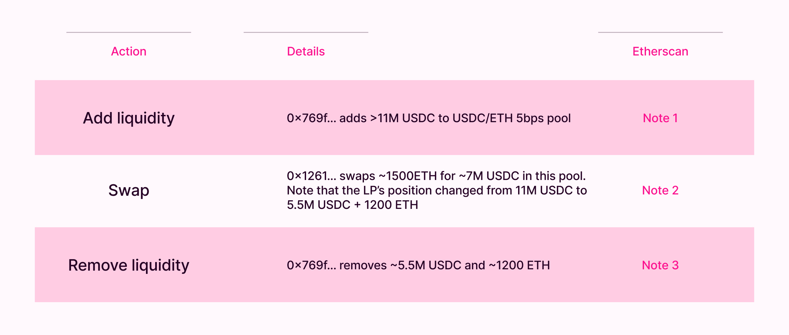

# Liquidity Operator: JIT Rebalancing Hook

## Intro and Objectives

### Lesson Objectives

- Understand how hooks can benefit LPs, not just swappers
- Understand the JIT Liquidity strategy and how it works
- Get inspiration for Capstone project ideas

### Introduction

Most of the topics we have covered so far are about benefiting swappers, or adding new functionality to Uniswap. Today we will take our first look at exploring a hook design that can help maximize yield for LPs - a certain kind of them at least.

This is also the first conceptual lesson. We will not be writing code today or have a step-by-step design. Rather, this lesson is meant to be for exploration and inspiration. We will understand an alternative design mechanism, and also showcase an idea that you can take and build as your capstone project.

## LP Fees

When liquidity providers add liquidity to Uniswap they generally do so within a certain tick range. This liquidity is either "active" or "inactive"


If a liquidity position is across a tick range that includes the current tick value (i.e. the liquidity covers the current price), that is "active". Any liquidity position above or below that which doesn't include the current tick is inactive liquidity.

When swappers conduct swaps they tap into the active liquidity positions to facilitate their swaps. They take the token they're purchasing from the active liquidity, and settle the token they're selling there.

Since the LPs are the ones making this liquidity available, the swapper pays a certain amount of fees called LP Fees in the input token of their swap that is distributed as yield to all LPs whose liquidity was active at the time of the given swap. The yield is distributed proportional to how much liquidity each LP was responsible for placing in that active range.

## LP Rebalancing

As swaps happen though, the price of the pool is also shifting. Positions that were active could become inactive if the price shifts enough, and previously inactive positions can become active. This means that LPs who consistently want to be paid out LP fees need to periodically rebalance their liquidity (i.e. update their tick range) to make sure their liquidity is considered active.

Uniswap doesn't automatically rebalance positions for LPs, since some LPs may not want to provide that liquidity outside their predetermined range. This has spawned a whole niche area of protocols which integrate with AMMs like Uniswap and perform automatic rebalancing for LPs based on defined criteria.

Sort of a side note but important to note is that each LP strategy has its own pros and cons. Creating an LP position is akin to signalling a long or short position on the asset depending on what tick range you're providing liquidity in due to impermanent losses that can exist. We won't go too much into this concept, but there's a ton of material you can find online about impermanent loss and the risk LPs take upon themselves by choosing to become an LP.

## JIT Liquidity

What we are focusing on today is the strategy of JIT Rebalancing. JIT stands for Just In Time. This is a strategy that enables JIT Liquidity on large trades with the aim of the LP attempting to make profit.

In a JIT Liquidity case, the LP:

- Observes a "large" swap transaction
- Adds sizeable liquidity to the pool right before the swap concentrated in a single tick that the swap will be in range for (i.e liquidity will be active)
- Lets the swap execute and receives a large portion of the LP Fee since the swap will mostly (if not entirely) go through their liquidity
- Removes the liquidity and fees accrued immediately

Often times simultaneously the LP will also do a hedging transaction in a different liquidity venue to offset their risk, and profiting off the difference between the transaction fees associated with the hedge and the LP fees earned from the AMM pool.

This strategy not only benefits the LP performing this action, but also the swapper since they essentially get access to zero slippage liquidity making their swap highly efficient. win-win for everyone!

## Example

This type of strategy has been observed on Uniswap v3 in the past - usually for large transactions in the order of millions of dollars. For example:



1. LP adds ~11 million USDC to USDC/ETH pool ([View on Etherscan](https://etherscan.io/tx/0xe824b92269f43bc4afd9e883ad38080b9388f2961fa0467f3334271f694bb371))
2. User swaps 1500 ETH for 7M USDC in the pool, with most of it going through the above liquidity and shifting the LP position to 5.5M USDC + 1200 ETH ([View on Etherscan](https://etherscan.io/tx/0x34d66ff483426f41b245881a92ce450579742e29aa85f256b752ed2403e5c8d1))
3. LP removes 5.5M USDC and 1200 ETH from the pool ([View on Etherscan](0xaadd749a18b2b75f8eec5c12e8be4ccb2471ea3f96db8f7a76beab0090a03c84))

## Economics of JIT Liquidity

For an LP to add JIT Liquidity, their expected profit must be positive. The LP's profit here comes from the difference between LP Fee earned and the cost of hedging their transaction. For example, supplying JIT liquidity on Uniswap, and simultaneously executing an offset trade on a different liquidity venue like a CEX (Coinbase, Binance, etc) with a lower fee rate to hedge.

Assuming the LP decides to concentrate their liquidity in the tick the swap is taking place in:

The revenue they earn:

```
Revenue = Liquidity Supplied to Swap * AMM LP Fee Rate
```

and, their cost:

```
Cost = (Liquidity Supplied to Swap \* Fee Rate of other exchange)
    + Slippage on other exchange
    + Gas fees for adding and removing JIT liquidity on AMM
```

## Example Profitable Trade

Let's work through an example and understand this.

- Assume an ETH/USDC pool with a 5bps fee tier (i.e. 0.05% fees).
- Assume an alternative liquidity venue, e.g. a CEX, exists with ETH/USDC pool with 0.01% fees that has extremely deep liquidity available
- Assume spot price (price at current tick) is 1 ETH = 1000 USDC (for easier calculations)
- Assume spot price at the CEX is also 1 ETH = 1000 USDC

Say a whale wants to sell 5,000 ETH into the AMM pool. To execute the swap with no slippage, 5M USDC is required in liquidity at the current tick.

LP adds 5M USDC to the pool right before the swap.

Assume, without loss of generality and for simplicity, the whale's swap will 100% go through this LPs liquidity.

Whale is charged 0.05% fees on the input token, i.e. 2.5 ETH. The remaining 4997.5 ETH get swapped for 4.9975M USDC.

The LPs position now consists of

- 2500 USDC
- 5000 ETH
- Assuming now the LP also conducts a hedging trade at the CEX selling 5000 ETH at a 1 bps fee with very deep liquidity available to them and they are able to get 4.9995M USDC for it after fees.

Final LP balance = 5,002,000 USDC.

**Therefore, the LP made 2,000 USDC in profit in this trade.**

The LP also may have incurred gas cost for their transactions, which may slightly reduce their overall profit. This is true for Uniswap v3 where JIT Liquidity was added through MEV Bundles (and also included MEV auction fees in the cost), but not as necessary in v4 with hooks.

## Profit Constraints

The above example showed a profitable trade, but the scenarios isn't always possible.

It is not guaranteed that the alternative liquidity venue will have extremely deep liquidity available causing minimal slippage. While top token pools (like ETH/USDC) are generally quite liquidity dense on centralized exchanges, this strategy doesn't work well for less popular coins.

Also, it is not guaranteed that the whale's entire swap will flow through the LPs JIT liquidity only, since other liquidity will also exist at the current tick. In that case, the LP won't get 100% of the swap fees paid by the swapper, and liquidity supplied to the swap by the LP will be less than the total liquidity the LP added to the pool.

Therefore, JIT Liquidity can be profitable for LPs when they have access to being able to offset the trade at an alternative venue with a lower fee rate at the same cost basis.

## JIT Liquidity in v3 vs v4

Uniswap has a blog post on frequency of JIT Liquidity transactions occurring in v4 along with some data analysis that can be found here - https://blog.uniswap.org/jit-liquidity#user-content-fn-5.

There are a few things that were important considerations for LPs following this strategy in v3 that now have alternatives in v4 reducing the overall cost of doing this:

1. In v3, the LP needed to incur gas fees of adding/removing liquidity around the swap transaction. Assuming a hook design where this can happen in `beforeSwap` and `afterSwap` - this cost can be offloaded to the swapper as it is incurred during execution of their `swap` transaction.
2. In v3, liquidity needed to be added right before the swap, and removed right after the swap. This was done through Flashbots bundles and required the LP to therefore pay a searcher fee, increasing their overall cost. By providing this liquidity in hooks instead, no searcher fee is required, and you don't need to beat other searchers either since you have access to the true state of the pool during execution in `beforeSwap`.
3. In v3, due to this happening through MEV Bundles, LPs could simultaneously find a route on alternative liquidity venues where they could hedge this trade. However, since hooks cannot synchronously fetch offchain data, this implies the LP must have access to a liquidity venue where they can safely assume they will be able to hedge the transaction at a lower cost basis than the AMM swapper.

So - overall - v4 allows some costs to be reduced for the LP wishing to follow this strategy, but also potentially increases the risk around hedging (especially if the hedging is to happen on an offchain liquidity venue).

## Mechanism Design

With the context out of the way then let's talk a bit around how something like this can work. This is not a step-by-step guide so we won't be writing code. Instead, we'll just think about the general flow of things and leave some questions open ended.

At it's core, we want the liquidity to be added just in time through beforeSwap and then removed afterSwap. To do so, the hook must:

1. Own the liquidity the LP plans to use for this strategy, allowing the hook to provision the liquidity automatically.
2. Have some logic to differentiate between a regular swap and a "large" swap, since this strategy is only really profitable on large swaps.
3. If possible, have the ability to hedge the transaction.

For (1), this means the LP must either give approval over their tokens, or actually transfer the tokens, to the hook contract upfront. For example, the LP can send 10M USDC to the hook contract if the hook is configured such that swaps around 9-10 million USD will be treated through JIT liquidity.

As a side effect of this, the hook must also have a way for the LP to withdraw their tokens back out - either through some sort of receipt token they get back or just some information stored in the hook contract.

For (2), this is fairly open-ended depending on how "general purpose" the hook is meant to be. Assuming this is a relatively general purpose hook that wants to cater to multiple LPs, not a single large market maker running their own AMM pools, maybe this should be somehow configurable? The LP, when providing tokens to the hook to use for this strategy, can perhaps specify some conditions which can be evaluated to determine if a given swap is considered large enough to perform this strategy on. Alternatively, it can be made simpler and perhaps just designed as being triggered if the swap is trading a certain threshold percentage of the pool reserves.

For (3), this is possible if the alternative liquidity venue in question is also onchain. In this case, the hook can execute the hedge transaction inside `afterSwap` on the alternative source. However, this situation is rare - as a large informed swapper would likely just go through the alternative source if a highly liquidity dense lower fee pool was available to them.

Assuming an offchain liquidity source, perhaps the LP can specify an "earnings receiver address" when providing liquidity - which can be an EOA controlled by an offchain bot or something. The hook transfers funds in afterSwap to that address, and an offchain script notices this transaction and then executes a hedge transaction offchain by doing what it needs to with that money.

Alternatively, under the assumption that the LP does not need access to the withdrawn liquidity and already has a sufficient amount of both tokens to hedge their transaction, the hook can simply trigger an event that executes a hedging transaction offchain instantly after the AMM swap which decreases the latency until the hedge transaction can be executed.

## Conclusion

In this lesson, we went over the concept of JIT Liquidity, looked at a real world example transaction from Uniswap v3, understood how LPs can profit from this strategy, looked at the benefit to swappers, and how Uniswap v4 can make this easier.

Overall, if done properly, this strategy benefits both the swapper and the LP providing JIT Liquidity. Doing it through hooks does still open up some risk around hedging the transaction - but under different assumptions can be solved for differently.

If you have any questions, feedback, or thoughts - would love to take them up in the Discord and discuss them. If you actually decide to build this out for your Capstone, it would be awesome to see how you solve for the aforementioned problems and what kind of results you can present.
